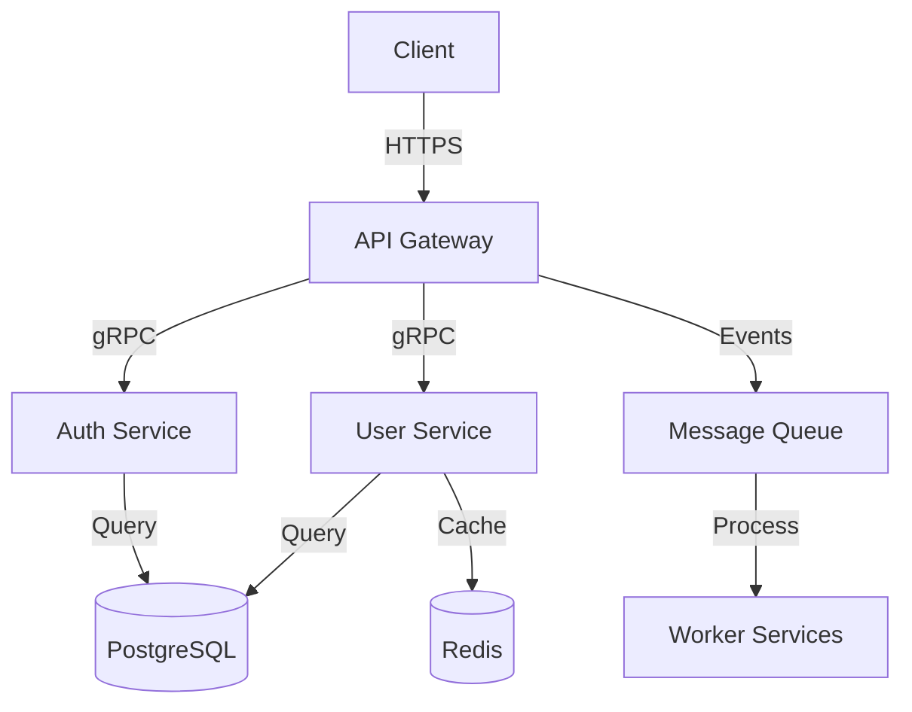

# Octovel Developer & Code Standards

**Version 2.0 — Effective October 2025**

This comprehensive guide defines the coding standards, repository practices, development workflows, and collaboration principles for all Octovel projects. It ensures maintainability, consistency, security, and quality across our entire technology stack.

---

## Table of Contents

1. [Core Philosophy & Principles](#1-core-philosophy--principles)
2. [Language & Technology Standards](#2-language--technology-standards)
3. [Repository Organization](#3-repository-organization)
4. [Code Style & Formatting](#4-code-style--formatting)
5. [Version Control & Git Workflow](#5-version-control--git-workflow)
6. [Code Review & Collaboration](#6-code-review--collaboration)
7. [Testing & Quality Assurance](#7-testing--quality-assurance)
8. [Documentation Standards](#8-documentation-standards)
9. [Security & Privacy](#9-security--privacy)
10. [Performance & Optimization](#10-performance--optimization)
11. [Error Handling & Logging](#11-error-handling--logging)
12. [API Design & Integration](#12-api-design--integration)
13. [Database & Data Management](#13-database--data-management)
14. [DevOps & CI/CD](#14-devops--cicd)
15. [Containerization & Deployment](#15-containerization--deployment)
16. [Monitoring & Observability](#16-monitoring--observability)
17. [Dependency Management](#17-dependency-management)
18. [Accessibility & Internationalization](#18-accessibility--internationalization)
19. [Open Source Contributions](#19-open-source-contributions)
20. [Professional Development & Knowledge Sharing](#20-professional-development--knowledge-sharing)

---

## 1 Core Philosophy & Principles

### 1.1 Development Values

Our engineering culture is built on five foundational values that guide every decision and implementation:

**Quality Over Speed**: We prioritize well-crafted, maintainable code over rushed implementations. Technical debt is expensive, and shortcuts taken today become bottlenecks tomorrow. Every engineer should feel empowered to push back on unrealistic timelines if quality would be compromised.

**Clarity Over Cleverness**: Code is read far more often than it is written. We value straightforward implementations that any team member can understand over clever one-liners that require deep language expertise to comprehend. If you find yourself being clever, step back and consider a simpler approach.

**Consistency Over Preference**: Individual preferences take a backseat to team standards. Even if you prefer tabs over spaces or a different bracket style, consistency across our codebase reduces cognitive load and makes code reviews more effective. Follow the established patterns, and propose changes through proper channels if you believe improvements are warranted.

**Simplicity Over Complexity**: The best solution is often the simplest one that solves the problem effectively. Avoid premature optimization, over-engineering, and unnecessary abstractions. Build what you need today, not what you might need in the future. Complexity should be justified by measurable requirements, not theheoretical scenarios.

**Proactive Over Reactive**: Anticipate issues through comprehensive testing, monitoring, and documentation rather than waiting for problems to emerge in production. Write defensive code, handle edge cases, and plan for failure modes. A small investment in prevention saves enormous effort in remediation.

### 1.2 Engineering Principles

These principles form the foundation of how we approach software design and implementation:

**DRY (Don't Repeat Yourself)**: Duplication creates maintenance burdens and increases the likelihood of bugs. When you find yourself copying code, extract it into a reusable function, module, or component. However, be cautious of premature abstraction; sometimes a little duplication is better than the wrong abstraction.

**SOLID Principles**: Apply object-oriented design principles appropriately. Single Responsibility Principle ensures classes and functions have one clear purpose. Open/Closed Principle encourages extension without modification. Liskov Substitution Principle maintains type safety in inheritance hierarchies. Interface Segregation Principle prevents bloated interfaces. Dependency Inversion Principle promotes loose coupling through abstractions.

**YAGNI (You Aren't Gonna Need It)**: Don't build features, abstractions, or infrastructure before they're actually required. Speculative development often leads to unused code that still requires maintenance. Focus on current, concrete requirements rather than hypothetical future needs.

**KISS (Keep It Simple, Stupid)**: Favor straightforward solutions over complex architectures. The simplest design that meets requirements is almost always the best design. Complexity should emerge naturally from requirements, not from architectural astronautics.

**Separation of Concerns**: Keep different aspects of your system isolated and focused. Presentation logic should be separate from business logic, which should be separate from data access. This separation makes code more testable, maintainable, and easier to reason about.

**Fail Fast**: Detect and report errors as early as possible rather than allowing invalid state to propagate through your system. Validate inputs at boundaries, use strong typing, and throw exceptions when invariants are violated. Silent failures and corrupted data are far more dangerous than loud errors.

### 1.3 Code Ownership Philosophy

**Collective Code Ownership**: No code "belongs" to any individual engineer. Any team member should feel comfortable modifying any part of the codebase. This approach prevents knowledge silos, distributes expertise, and ensures the team can continue functioning if someone is unavailable.

**Pride in Craftsmanship**: Despite collective ownership, every engineer should treat code as if they'll maintain it forever. Write clear variable names, add helpful comments, structure code logically, and leave it better than you found it. Your name is on every commit, make it count.

**The Boy Scout Rule**: Always leave code cleaner than you found it. If you notice unclear variable names, missing documentation, or inefficient implementations while working on a feature, improve them. Small incremental improvements compound into significant codebase health over time.

**Accountability and Ownership**: While code is collectively owned, individuals are accountable for their changes. If your commit introduces a bug, own it, fix it, and learn from it. Blame-free culture doesn't mean consequence-free, it means we focus on systemic improvements rather than individual fault.

### 1.4 Decision Making Framework

**Data-Driven Decisions**: Base architectural and technical decisions on objective metrics and benchmarks rather than opinions or assumptions. When evaluating competing solutions, measure performance, resource usage, development time, and maintenance burden. Document your methodology and findings.

**Architecture Decision Records (ADRs)**: Document significant technical decisions in ADR format. Include the context that led to the decision, alternatives considered, the decision made, and its consequences (both positive and negative). ADRs create an invaluable historical record that helps future engineers understand why systems are designed as they are.

**Request for Comments (RFC) Process**: Major architectural changes, new frameworks, or significant departures from existing patterns require an RFC. Write a detailed proposal, solicit feedback from relevant stakeholders, address concerns, and achieve consensus before implementation. RFCs prevent costly mistakes and ensure team alignment.

**Experimentation and Spikes**: For uncertain or novel problems, time-boxed spikes allow exploration without commitment. A spike is an experiment to answer a specific question, not production code. Set clear objectives, a time limit (typically 1-3 days), and success criteria. Share findings regardless of outcome.

### 1.5 Balance and Trade-offs

Engineering is fundamentally about trade-offs. Every decision involves balancing competing concerns:

| Concern | Trade-off |
|---------|-----------|
| **Speed vs Quality** | Fast delivery may sacrifice long-term maintainability |
| **Flexibility vs Simplicity** | Generic solutions add complexity for uncertain future needs |
| **Performance vs Readability** | Optimizations often obscure intent and reduce clarity |
| **Innovation vs Stability** | New technologies offer capabilities but introduce risk |

Make trade-offs consciously and explicitly. Document your reasoning, acknowledge what you're sacrificing, and revisit decisions as circumstances change. The right answer depends on context, constraints, and organizational priorities.

---

## 2 Language & Technology Standards

### 2.1 Supported Languages and Their Purposes

Octovel maintains a curated set of languages, each chosen for specific strengths and use cases. This intentional limitation prevents fragmentation, ensures adequate expertise exists within the team, and simplifies hiring and training.

| Language | Primary Use Cases | When to Choose | When to Avoid |
|----------|------------------|----------------|---------------|
| **TypeScript** | Web applications, REST/GraphQL APIs, CLI tools, build tooling | Rich web ecosystem, type safety for JavaScript, rapid development, Node.js deployment | CPU-intensive tasks, real-time systems, memory-constrained environments |
| **Python** | Data processing, machine learning, automation scripts, DevOps tooling | ML libraries, scientific computing, quick prototyping, extensive third-party packages | High-performance APIs, concurrent systems, large-scale applications |
| **Rust** | Systems programming, performance-critical services, CLI utilities, WebAssembly | Memory safety without garbage collection, extreme performance, concurrency, embedded systems | Rapid prototyping, projects with tight deadlines, teams without Rust experience |
| **C/C++** | Low-level systems, game engines, embedded software, legacy integration | Hardware interaction, real-time requirements, existing C++ codebases | Modern web services, business logic, prototyping |
| **C#** | Enterprise applications, Unity or Avalonia app development, Windows/.NET stack | Mature tooling (VS/Rider), enterprise support, great for Avalonia cross-platform GUIs | Cross-platform CLI tools, microservices (prefer Go/Rust), resource-constrained environments |
| **Go** | Microservices, cloud infrastructure, concurrent systems, networking tools | Built-in concurrency, fast compilation, simple deployment, cloud-native | Complex business logic, rapid prototyping, GUI applications |
| **Java** |	Enterprise backends, Android legacy apps, financial systems |	JVM portability, mature ecosystem, robust runtime performance, huge dev base	| Small utilities, resource-limited environments, high iteration-speed projects |
| **Zig** |	Low-level systems, embedded dev, cross-compilation tooling, C replacement | 	Simplicity, manual but safe memory management, predictable performance, C interop | 	Immature ecosystem, web/backend projects, rapid iteration needs |

### 2.2 Language Selection Decision Tree

When starting a new project or component, use this decision framework:

**Step 1: Requirements Analysis**
- What are the performance characteristics (latency, throughput, resource constraints)?
- What is the expected scale (users, data volume, request rate)?
- What are the integration requirements (APIs, databases, third-party services)?
- What are the deployment constraints (cloud, on-premise, edge, mobile)?

**Step 2: Team Considerations**
- What expertise exists within the team currently?
- How quickly do we need to deliver the initial version?
- What is the expected maintenance burden and lifecycle?

**Step 3: Ecosystem Evaluation**
- What libraries and frameworks are available and mature?
- What is the community support and documentation quality?
- How active is development and how responsive are maintainers?

**Step 4: Long-term Viability**
- What is the technology's adoption trajectory?
- How stable is the language and ecosystem?
- What are the migration risks if we need to change later?

### 2.3 Framework Selection Criteria

Frameworks significantly impact development velocity, code quality, and long-term maintainability. Choose frameworks deliberately using these criteria:

**Maturity and Stability**: Prefer frameworks with proven track records in production environments. A framework should have been through multiple major versions, demonstrating commitment to backward compatibility and thoughtful evolution. Avoid pre-1.0 frameworks for critical systems.

**Community and Ecosystem**: Strong communities provide extensive documentation, tutorials, plugins, and troubleshooting resources. Measure community health by GitHub stars, NPM downloads, Stack Overflow activity, conference presence, and responsive issue tracking.

**Performance Characteristics**: Understand the framework's performance profile through benchmarks and real-world case studies. Some frameworks prioritize developer ergonomics over raw speed, which may be appropriate for many use cases but critical for high-traffic systems.

**Opinion Level**: Frameworks exist on a spectrum from unopinionated (providing building blocks) to highly opinionated (enforcing specific patterns). Choose based on your team's preferences and the problem domain. Highly opinionated frameworks accelerate development but reduce flexibility.

**Bundle Size and Dependencies**: For frontend frameworks and libraries, bundle size directly impacts user experience. For backend frameworks, dependency count affects security surface area and maintenance burden. Evaluate the cost of convenience.

**Vendor Lock-in Risk**: Some frameworks create tight coupling to specific vendors, platforms, or ecosystems. Understand exit costs and migration paths. Prefer standards-based approaches and abstraction layers when reasonable.

**Learning Curve and Documentation**: Framework complexity should match team expertise and timeline. Excellent documentation, clear examples, and active learning resources significantly reduce onboarding time and ongoing frustration.

### 2.4 Approved Technology Stack

These frameworks and libraries have been vetted and approved for use across Octovel projects:

**TypeScript Ecosystem:**
- **Backend**: Express/Hono (mature, flexible), Fastify (high performance), Nest.js (enterprise patterns)
- **Frontend**: React (component library), Next.js (full-stack framework), Vite (build tool)
- **Testing**: Vitest (fast, modern), Jest (mature, comprehensive), Playwright (E2E)
- **Utilities**: Lodash (functional utilities), Zod (schema validation), date-fns (date manipulation)

**Python Ecosystem:**
- **Web**: FastAPI (modern, async), Flask (lightweight, flexible), Django (with justification for admin-heavy apps)
- **Data**: Pandas (analysis), NumPy (numerical computing), Polars (high-performance DataFrames)
- **ML/AI**: PyTorch (deep learning), Scikit-learn (traditional ML), Hugging Face (transformers)
- **Testing**: Pytest (flexible, powerful), Hypothesis (property-based testing)

**Rust Ecosystem:**
- **Async Runtime**: Tokio (comprehensive, mature)
- **Web**: Axum (ergonomic, type-safe), Actix (high-performance)
- **Serialization**: Serde (universal serialization), Bincode (binary format)
- **CLI**: Clap (argument parsing), Indicatif (progress bars)

**Database Technologies:**
- **Relational**: PostgreSQL (primary choice), MySQL (legacy support only)
- **Document**: MongoDB (with justification), DynamoDB (AWS-native projects)
- **Cache**: Redis (distributed cache, pub/sub), Memcached (simple caching only)
- **Search**: Elasticsearch (full-text search), MeiliSearch (lightweight alternative)
- **Time-series**: TimescaleDB (PostgreSQL extension), InfluxDB (high-volume metrics)

**Infrastructure and DevOps:**
- **Containers**: Docker (mandatory for all services)
- **Orchestration**: Kubernetes (production), Docker Compose (development)
- **CI/CD**: GitHub Actions (preferred), GitLab CI (enterprise), CircleCI (legacy)
- **IaC**: Terraform (cloud infrastructure), Ansible (configuration management)
- **Monitoring**: Prometheus + Grafana (metrics), ELK Stack (logging), Jaeger (tracing)

Keep in mind that our products must be as dependency-less as possible.

### 2.5 Technology Evaluation Process
Introducing new technologies requires formal evaluation to prevent ecosystem fragmentation:

**Stage 1: Proposal (1-2 days)**
- Document the problem the technology solves
- Explain why existing approved technologies are insufficient
- Identify the team member who will champion and support the technology
- Create a brief proposal with alternatives considered

**Stage 2: Spike (1-5 days)**
- Build a proof-of-concept demonstrating key use cases
- Evaluate documentation quality and learning curve
- Assess performance characteristics and resource requirements
- Identify potential integration challenges

**Stage 3: Review (1 week)**
- Present findings to engineering team in technical review meeting
- Address questions, concerns, and alternative suggestions
- Update proposal with feedback and additional research
- Achieve consensus or identify blocking concerns

**Stage 4: Pilot (1-3 months)**
- Use technology in a non-critical project or component
- Document patterns, best practices, and gotchas
- Gather team feedback on developer experience
- Evaluate production behavior and operational characteristics
**Stage 5: Adoption Decision**
- Formally approve for general use, approve with restrictions, or reject
- Document decision in ADR with rationale and context
- Update this standards document if approved
- Create internal guides and training materials

**Stage 5: Adoption Decision**
- Formally approve for general use, approve with restrictions, or reject
- Document decision in ADR with rationale and context
- Update this standards document if approved
- Create internal guides and training materials

### 2.6 Language-Specific Best Practices

Each language has idiomatic patterns and anti-patterns that significantly impact code quality:

**TypeScript Best Practices:**
- Enable strict mode in tsconfig.json to catch type errors early
- Avoid implicit any types; be explicit about type contracts
- Use discriminated unions for state machines and variant types
- Prefer functional composition over deep class hierarchies
- Leverage utility types (Partial, Pick, Omit, Record) for type transformations
- Use const assertions for literal type inference
- Implement branded types for domain primitives (UserId, EmailAddress)

**Python Best Practices:**
- Add type hints to all public functions and methods for documentation and static analysis
- Use dataclasses or Pydantic for structured data rather than dictionaries
- Follow PEP 8 style guide rigorously; use Black for consistent formatting
- Prefer pathlib for file operations over os.path for better API
- Use context managers for resource management (with statements)
- Leverage list comprehensions and generator expressions for concise iteration
- Avoid mutable default arguments; use None and initialize in function body

**Rust Best Practices:**
- Follow Rust API guidelines for public interfaces
- Use Err for recoverable errors, panic only for unrecoverable bugs
- Prefer owned types over references in public APIs for simplicity
- Leverage the type system to enforce invariants at compile time
- Use builder patterns for complex object construction
- Implement Debug, Clone, and other derivable traits appropriately
- Document unsafe code thoroughly with safety invariants

**C++ Best Practices:**
- Follow C++ Core Guidelines for modern C++ practices
- Use RAII for all resource management; avoid manual memory management
- Prefer smart pointers (unique_ptr, shared_ptr) over raw pointers
- Use const correctness to communicate and enforce immutability
- Leverage move semantics to avoid unnecessary copies
- Enable all compiler warnings and treat them as errors
- Use standard library containers and algorithms instead of C arrays

**C# Best Practices:**
- Follow Microsoft C# coding conventions for consistency with ecosystem
- Enable nullable reference types to catch null reference errors
- Use async/await throughout; avoid blocking on async operations
- Prefer LINQ for collection operations for readability and optimization
- Implement IDisposable for resource cleanup with using statements
- Use records for immutable data transfer objects
- Leverage pattern matching for cleaner conditional logic

**Go Best Practices:**
- Follow Effective Go guidelines and standard project layout
- Keep interfaces small and focused; prefer composition over inheritance
- Use defer for cleanup actions to ensure execution
- Handle errors explicitly; avoid panic except for programmer errors
- Design for testability with dependency injection via interfaces
- Use channels and goroutines idiomatically; avoid shared mutable state

Keep packages focused and cohesive with clear responsibilities

## 3 Repository Organization

### 3.1 Standard Directory Structure Philosophy

A well-organized repository reduces cognitive load, accelerates onboarding, and makes navigation intuitive. Our standard structure applies across languages with appropriate variations for language-specific conventions.

**Core Principles:**
- **Predictability**: Developers should know where to find things without searching
- **Scalability**: Structure should work for small and large projects
- **Tooling Compatibility**: Standard locations for configs, tests, and documentation
- **Clear Boundaries**: Separation between source, tests, documentation, and infrastructure

### 3.2 Universal Repository Structure

Every Octovel repository follows this foundational structure with language-specific adaptations:

```
project-name/
├── .github/              # GitHub-specific configurations and automation
├── documentation/        # All documentation beyond basic README
├── source/               # Primary source code (or lib/, app/ depending on language)
├── tests/                # Test code mirroring src/ structure
├── scripts/              # Development and deployment automation
├── infrastructure/       # Container definitions and deployment configs
├── tools/                # Custom development tools and utilities
├── .editorconfig         # Cross-editor coding style
├── .gitignore            # Version control exclusions
├── .gitattributes        # Git behavior configuration
├── README.md             # Project overview and quick start
├── CHANGELOG.md          # Version history and release notes
├── CONTRIBUTING.md       # Contribution guidelines
├── LICENSE               # Open source license
└── SECURITY.md           # Security policy and vulnerability reporting
```

**GitHub Configuration (`.github/`):**
- This directory contains GitHub-specific automation and templates that standardize interactions and processes:
`workflows/` - CI/CD pipeline definitions for automated testing, building, and deployment
- `ISSUE_TEMPLATE/` - Structured templates for bug reports, feature requests, and other issue types
- `PULL_REQUEST_TEMPLATE.md` - Standard format for pull requests ensuring consistent information
- `CODEOWNERS` - Automatic reviewer assignment based on file paths and ownership
dependabot.yml - Automated dependency update configuration

**Documentation Structure (`docs/`):**

Comprehensive documentation is critical for maintainability and knowledge transfer:

- `architecture/` - System design documents, component diagrams, data flow documentation
- `api/` - API reference documentation, endpoint specifications, integration guides
- `guides/` - User guides, developer guides, deployment procedures, troubleshooting
- `adr/` - Architecture Decision Records documenting significant technical choices
- `diagrams/` - Visual representations created with tools like Mermaid or draw.io
- `meetings/` - Technical design review notes and decision logs

**Source Code Organization (`source/`):**

The `source/` directory structure varies by language and application type but follows consistent principles:

- `core/` or `domain/` - Business logic and domain models independent of infrastructure
- `api/` or `handlers/` - HTTP endpoints, request/response handling, routing
- `services/` - Service layer coordinating business logic and infrastructure
- `repositories/` or `dal/` - Data access layer abstracting database operations
- `models/` or `entities/` - Data structures and domain entities
- `utilities/` or `library/` - Shared utilities and helper functions
- `configuration/` - Configuration loading and validation
- `middleware/` - Request processing middleware for cross-cutting concerns

**Test Organization (`tests/`):**

Tests mirror the source structure for easy navigation between implementation and tests:

- `unit/` - Fast, isolated tests of individual functions and classes
- `integration/` - Tests of multiple components working together
- `e2e/` or `acceptance/` - End-to-end tests simulating real user workflows
- `performance/` or `load/` - Performance and stress testing scripts
- `fixtures/` - Test data, mocks, and reusable test helpers
- `factories/` - Test data generators for creating valid test objects

**Infrastructure (`infrastructure/`):**

All deployment and infrastructure-related files live here, separated from application code:

- `docker/` - Dockerfiles for various build stages and environments
- `k8s/` or `kubernetes/` - Kubernetes manifests, Helm charts, and deployment configs
- `terraform/` - Infrastructure as Code definitions for cloud resources
- `ansible/` - Configuration management playbooks
- `scripts/` - Deployment automation and operational scripts

You may of course create other folders and files.

### 3.3 Monorepo vs Polyrepo Strategy

The choice between monorepo and polyrepo architectures significantly impacts development workflow, code sharing, and deployment processes.

**Monorepo Architecture:**
- A single repository containing multiple related projects, services, or packages. Suited for:
- Organizations with strong coupling between components
- Teams that deploy multiple services together
- Projects sharing significant code or dependencies
- Need for atomic cross-project changes
- Desire for unified versioning and release coordination

**Monorepo Advantages:**
- Simplified dependency management across projects
- Atomic commits spanning multiple projects
- Easier large-scale refactoring
- Single source of truth for all code
- Consistent tooling and standards enforcement
- Simplified developer setup

**Monorepo Challenges:**
- Repository size and clone time grow over time
- Build complexity increases with project count
- Access control is all-or-nothing
- CI/CD pipelines must be intelligent about what to test
- Tooling requirements are more sophisticated

**Recommended Monorepo Structure:**
```
octovel-platform/
├── packages/
│   ├── api-server/       # Backend API service
│   ├── web-client/       # Frontend web application
│   ├── mobile-app/       # React Native mobile app
│   ├── shared-types/     # Shared TypeScript types
│   ├── ui-components/    # Reusable UI component library
│   └── utils/            # Shared utility functions
├── tools/
│   ├── build-tools/      # Custom build scripts
│   └── generators/       # Code generation templates
├── docs/                 # Cross-project documentation
└── turbo.json           # Turborepo or similar configuration
```

**Polyrepo Architecture:**

Separate repositories for each project or service. Suited for:

- Independent services with minimal code sharing
- Teams with clear ownership boundaries
- Services with different release cycles
- Need for fine-grained access control
- Microservices architecture with service autonomy

**Polyrepo Advantages:**
- Clear ownership and responsibility boundaries
Independent versioning and release cycles
- Smaller repository sizes and faster clones
- Flexible access control per repository
- Simpler CI/CD per repository
- Technology diversity across services

**Polyrepo Challenges:**
- Dependency management across repositories
- Coordinating changes across multiple repos
- Duplicated configuration and tooling
- More complex developer environment setup
- Consistency enforcement requires more discipline

**Recommended Polyrepo Organization:**
```
octovel-api-server/       # Backend service
octovel-web-client/       # Frontend application
octovel-mobile-app/       # Mobile application
octovel-shared-types/     # Shared library (published to npm)
octovel-ui-components/    # Component library (published to npm)
```

**Hybrid Approach:**

Some organizations benefit from multiple monorepos organized by domain or team:

```
octovel-platform/         # Core platform services (monorepo)
├── api-gateway/
├── auth-service/
└── user-service/

octovel-data/             # Data processing services (monorepo)
├── ingestion-pipeline/
├── analytics-engine/
└── reporting-service/

octovel-mobile/           # Mobile applications (separate repo)
octovel-web/              # Web applications (separate repo)
```

## 3.4 File and Directory Naming Conventions

Consistent naming reduces confusion and makes scripts and tooling more reliable:

| **Language/Context** | **Files** | **Directories** | **Rationale** |
| -------------------- | --------- | --------------- | ------------- |
| TypeScript/JavaScript | kebab-case.ts | kebab-case/ | Web standard, npm packages use kebab-case |
| Python | snake_case.py | snake_case/ | PEP 8 standard, Python convention |
| Rust | snake_case.rs | snake_case/ | Rust convention, cargo defaults |
| C++ | kebab-case.cpp | kebab-case/ | Readability, avoid Windows case sensitivity |
| C# | PascalCase.cs | PascalCase/ | Microsoft convention, framework standard |
| Go | snake_case.go | snake_case/ | Go convention, lowercase imports |
| Configuration | lowercase.config.ext | N/A | Clear identification as config file |
| Test Files | <name>.test.ext or e <name>.spec.ext | N/A | Clear identification as test |
| Type Definitions | <name>.d.ts | N/A | TypeScript convention |

**Special Naming Rules:**
- Component files (React, Vue): Use PascalCase.tsx matching the component name
- Constant files: You may use `UPPER_CASE.ts` for files exporting only constants
- Barrel files: Use `index.ts` for re-exports from a directory
- README files: Always `README.md` in all caps for visibility
- Hidden config files: Prefix with `.` (`.env`, `.eslint`rc) following Unix convention

## 3.5 Configuration File Management

Configuration should be explicit, versioned, and environment-specific:

**Local Development Configuration:**
- Use `.env.example` committed to version control showing required variables
- Actual `.env` files never committed, listed in `.gitignore`
- Provide sensible defaults for local development
- Document all environment variables with comments in `.env.example`

**Environment-Specific Configuration:**
- Separate config files for development, staging, production
- Store configs in config/ directory or use cloud configuration services
- Never commit secrets; use secret management tools (AWS Secrets Manager, HashiCorp Vault)
- Use configuration validation on application startup to fail fast

**Configuration Hierarchy:**
- Environment variables (highest priority, set in deployment)
- Environment-specific config files (`configuration/production.json`)
- Default config file (`configuration/default.json`)
- Hardcoded defaults (lowest priority, in source code)

**Configuration Best Practices:**
- Validate all configuration on startup with clear error messages
- Use strong typing for configuration (Zod in TypeScript, Pydantic in Python)
- Document configuration options thoroughly
- Support both environment variables and config files
- Never use different config formats across environments
- Log sanitized configuration on startup (without secrets) for debugging

## 3.6 README Requirements

Every repository must include a comprehensive README.md that serves as the entry point for all developers:

**Essential Sections:**

**Project Name and Description**: One-paragraph overview explaining what the project does and why it exists.

**Key Features**: Bullet list of 3-7 main capabilities or characteristics that differentiate this project.

**Prerequisites**: Explicit listing of required software, versions, and system requirements before installation.

**Installation**: Step-by-step instructions that a new developer can follow to get the project running locally.

**Configuration**: Explanation of environment variables, config files, and customization options.

**Usage**: Basic examples showing common use cases and workflows.

**Testing**: Commands and procedures for running tests locally.

**Deployment**: Link to detailed deployment documentation or basic deployment overview.

**Contributing**: Link to CONTRIBUTING.md and brief summary of how to contribute.

**License**: Clear statement of licensing with link to full `LICENSE` file.

**Support**: How to get help, report bugs, or request features.

**Additional Recommended Sections:**
- Architecture overview or link to architecture docs
- API documentation link
- Known issues or limitations
- Changelog link
- Badge section showing build status, coverage, version

**README Anti-patterns to Avoid:**
- Stale information not updated as project evolves
- Missing or broken links to documentation
- Overly detailed content better suited for separate docs
- Installation instructions that don't work
- Missing troubleshooting section for common issues
- No examples or usage guidance

## 4 Code Style & Formatting

### 4.1 Automated Formatting Philosophy

Code formatting is not a matter of personal preference, it's a solved problem that tools handle better than humans. We use automated formatters universally to eliminate formatting debates, ensure consistency, and save code review time for substantive discussions.

**Formatting Principles:**
- Formatters run automatically on save in IDEs
- Pre-commit hooks prevent unformatted code from being committed
- CI pipelines reject improperly formatted code
- No manual formatting adjustments except in rare documented cases
- Format entire files, never partial formatting
- Formatting rules are configured once and rarely changed

**Benefits of Automated Formatting:**
- Zero time spent on formatting debates
- Diffs show logical changes, not whitespace changes
- Consistent style across entire codebase regardless of author
- New developers productive immediately without learning style preferences
- Refactoring tools work more reliably with consistent formatting


| Language | Primary Formatter | Configuration File | Line Length | Indentation |
| -------- | ----------------- | ------------------| ----------- | ---------- |
| TypeScript/JavaScript | Prettier | biome.json | 100 chars | 2 spaces |
| Python | Black + isort | pyproject.toml | 100 chars | 4 spaces (PEP 8) |
| Rust | rustfmt | rustfmt.toml | 100 chars | 4 spaces |
| C++ | clang-format | .clang-format | 100 chars | 4 spaces |
| C# | dotnet format | .editorconfig | 120 chars | 4 spaces |
| Go | gofmt (built-in) | None (standard) | No limit | Tabs |

**Why Line Length Matters:**
- The 100-character line limit strikes a balance between modern wide screens and practical considerations:
- Readable side-by-side diffs in code reviews
- Comfortable on laptop screens without horizontal scrolling
- Multiple editor panes visible simultaneously
Encourages breaking complex expressions into named variables

## 4.3 Linting Standards

While formatters handle code appearance, linters catch bugs, enforce best practices, and identify potential issues:

**Linter Responsibilities:**
- Detect unused variables and imports
- Identify potential runtime errors
- Enforce naming conventions
- Flag overly complex code
Check for security vulnerabilities
- Ensure type safety
- Verify documentation completeness

**Language-Specific Linters:**

**TypeScript/JavaScript:**
- ESLint with TypeScript-specific rules
- Rules for async/await correctness
- Prohibition of console.log in production code
- Enforcement of explicit return types
- Detection of floating promises
- Import organization rules

**Python:**
- Pylint for code quality
- Flake8 for style enforcement
- mypy for static type checking
- bandit for security vulnerability detection
- pydocstyle for documentation standards

**Rust:**
- Clippy for idiomatic Rust patterns
- Detection of common mistakes
- Performance optimization suggestions
- API guideline compliance
Unsafe code warnings

**C++:**
- clang-tidy with modernize checks
- Detection of memory leaks and undefined behavior
- Suggestion of modern C++ alternatives
- Performance anti-pattern detection
- Thread safety analysis

**C#:**
- StyleCop Analyzers for style consistency
- Microsoft.CodeAnalysis for best practices
- Security analyzers for vulnerability detection
- Performance analyzers for optimization opportunities

**Go:**
- golangci-lint aggregating multiple linters
- go vet for correctness issues
- staticcheck for bugs and performance
- errcheck for unhandled errors

## 4.4 Comprehensive Naming Conventions

Naming is one of the hardest and most important aspects of programming. Good names communicate intent, scope, and purpose without requiring documentation.

**Universal Naming Principles:**

**Be Descriptive**: Names should clearly communicate what something represents or does. Avoid abbreviations unless universally understood. `userAuthenticationService` is better than `usrAuthSvc`.

**Be Consistent**: Use the same terminology throughout your codebase. If you call something a "user" in one place, don't call it a "person" or "account" elsewhere without good reason.

**Be Appropriate to Scope**: Short names are acceptable for small scopes (loop variables like i for index), but larger scopes require more descriptive names.

**Avoid Meaningless Names**: Names like `data`, `info`, `manager`, `handler` without context provide no information. `userData` is barely better than data, but `authenticatedUser` tells a story.

**Use Positive Boolean Names**: Prefer `isEnabled` over `isDisabled`, `hasAccess` over `lacksAccess`. Positive logic is easier to reason about.

**Avoid Negated Booleans**: `if (!isNotReady)` is confusing. Use `isReady` instead.

**Language-Specific Naming Standards:**

**TypeScript/JavaScript Naming:**
- Variables and Functions: camelCase - `userName, calculateTotal, fetchUserData`
- Classes and Interfaces: PascalCase `- UserService, HttpClient, RequestOptions`
- Types: PascalCase - `UserId, RequestHandler, ErrorCode`
- Constants: UPPER_SNAKE_CASE - `MAX_RETRY_COUNT, API_BASE_URL, DEFAULT_TIMEOUT`
- Private Fields: Prefix with # or `private` - `#secretKey, #internalState, private _hooks`
- Boolean Variables: Prefix with `is`, `has`, `should`, `can` - `isAuthenticated`, `hasPermission`
- Enums: PascalCase for name, `UPPER_SNAKE_CASE` for values
- Acronyms: Treat as words - `HTTPClient` not `HttpClient`, `userID` not `userId`

**Python Naming:**
- Variables and Functions: snake_case - `user_name`, `calculate_total`, `fetch_user_data`
- Classes: PascalCase - UserService, HttpClient, RequestOptions`
- Constants: UPPER_SNAKE_CASE - `MAX_RETRY_COUNT`, `API_BASE_URL`
- Private Attributes: Prefix with underscore - `_internal_state`, `_secret_key`
- Protected Attributes: Single underscore - `_protected_method`
- Name Mangling: Double underscore for strong privacy - `__private_attribute`
- Magic Methods: Double underscore both sides - `__init__`,` __str__`

**Rust Naming:**
- Variables and Functions: snake_case - `user_name`, `calculate_total`
- Structs and Enums: PascalCase - `UserService`, `HTTPClient`
- Traits: PascalCase - `Serializable`, `Clone`, `Display`
- Constants and Statics: UPPER_SNAKE_CASE - `MAX_RETRY_COUNT`, `API_BASE_URL`
- Lifetimes: Single lowercase letter - `'a`, `'static`
- Type Parameters: Single uppercase letter or PascalCase - `T`, `E`, `Key`, `Value`

**C++ Naming:**
- Variables and Functions: camelCase or snake_case (choose one consistently)
- Classes and Structs: PascalCase - `UserService`, `HTTPClient`
- Member Variables: Suffix with underscore - `userName_`, `count_`
- Constants and Macros: UPPER_SNAKE_CASE - `MAX_RETRY_COUNT`
- Namespaces: lowercase or snake_case - `octovel`, `octovel::api`
- Template Parameters: PascalCase - `typename T`, `typename Key`

**C# Naming:**
- Variables and Parameters: camelCase - `userName`, `itemCount`
- Classes and Interfaces: PascalCase - `UserService`, `IRepository`
- Properties and Methods: PascalCase - `UserName`, `CalculateTotal`
- Private Fields: camelCase with underscore prefix -` _userName`, `_itemCount`
- Constants: PascalCase - `MaxRetryCount`, `DefaultTimeout`
- Events: PascalCase - `UserLoggedIn`, `DataReceived`
- Async Methods: Suffix with Async - `GetUserAsync`, `ProcessDataAsync`

**Go Naming:**
- Variables and Functions: camelCase or mixedCaps - `userName, calculateTotal`
- Exported Names: PascalCase - `UserService`, `HTTPClient`
- Unexported Names: camelCase - `userService`, `httpClient`
- Constants: PascalCase or camelCase - `MaxRetryCount` or `maxRetryCount`
- Interfaces: Often noun without I prefix - Reader, `Writer`, `Closer`
- Interface with Single Method: Often -er suffix - `Stringer`, `Handler`

**Domain-Specific Naming Patterns:**

**API Endpoints:** Use RESTful conventions with plural nouns for collections:
- `GET /users` - List users
- `GET /users/:id` - Get specific user
- `POST /users` - Create user
- `PUT /users/:id` - Update user
- `DELETE /users/:id` - Delete user

Database Tables and Columns: Use snake_case consistently across all database systems:
- Tables: Plural nouns - `users`, `order_items`, `authentication_tokens`
- Columns: Descriptive names - `created_at`, `updated_at`, `email_address`
- Foreign Keys: `<table>_id` pattern - `user_id`, `product_id`
- Junction Tables: Combined names - `users_roles`, `products_categories`

Test Names: Descriptive sentences explaining what is tested:
- `test_user_creation_with_valid_email`
- `test_authentication_fails_with_invalid_password`
- `should_return_404_when_user_not_found`
- `it_should_calculate_total_with_discount_applied`

Event Names: Past tense describing what happened:
- `UserCreated, OrderShipped, PaymentProcessed`
- `user_created, order_shipped, payment_processed`

Command Names: Imperative verbs describing actions:
- `CreateUser, ProcessOrder, SendEmail`
- `create_user, process_order, send_email`

## 4.5 Code Organization and Structure

Well-organized code reduces cognitive load and makes maintenance easier. These principles apply across all languages with appropriate adaptations.

**Function Length Guidelines:**

Functions should be focused, single-purpose units that fit on a single screen without scrolling.

| Metric | Target | Maximum | Action at Maximum |
| ------ | ------ | ------- | ----------------- |
| Lines of Code | 20-30  | 50 | Extract helper functions |
| Parameters | 2-3 | 4-5 | Use parameter objects | 
| Cyclomatic Complexity | 5-8 | 10 | Break into smaller functions |
| Nesting Depth | 1-2 | 3 | Use early returns |

**Why Short Functions Matter:**
- Easier to understand at a glance
- Easier to test in isolation
- Easier to reuse in different contexts
- Easier to optimize or refactor
- More descriptive names possible
- Better stack traces in errors

**When to Extract a Function:**
- Logic is repeated more than once
- A section has a distinct purpose that can be named
- Function exceeds 50 lines
- Function has more than 3 levels of nesting
- You need comments to explain what a section does
- You're using the word "and" to describe what the function does

**File Length Guidelines:**

Files should contain related functionality without becoming unwieldy.

| File Type | Target | Maximum Lines | Action at Maximum |
| ------ | ------ | ------- | ----------------- |
| Implementation | 200-300  | 500 | Split into multiple files |
| Test File | 300-400 | 600 | Split by test category | 
| Configuration | 50-100 | 200 | Split by environment |
| Interface/Types | 100-200 | 300 | Group related types |

**When to Split a File:**
- File exceeds maximum line count
- File contains multiple unrelated responsibilities
- Scrolling is required to understand file contents
- File contains multiple classes or modules
- Import list is excessively long (more than 20 imports)
- Team members consistently struggle to find code in the file

**Import Organization:**
**Organize imports consistently for readability and to minimize merge conflicts:**

**Import Order (from top to bottom):**
1. Standard library / language built-ins
2. Third-party framework imports (React, Express, etc.)
3. Third-party package imports
4. Internal shared package imports (monorepo packages)
5. Internal application imports (absolute paths)
6. Relative imports from parent directories
7. Relative imports from current directory
8. Type-only imports (TypeScript)

**Import Grouping Rules:**
- Separate each group with a blank line
- Within each group, sort alphabetically
- Avoid wildcard imports except for common namespaces
- Use named imports preferentially over default imports
- Keep import statements on single lines when possible
- Use path aliases to avoid deep relative paths

**Cyclomatic Complexity Management:**
Cyclomatic complexity measures the number of independent paths through code. High complexity correlates with defect density and testing difficulty.

**Complexity Thresholds:**
|Complexity|Rating|Action Required|
|-|-|-|
|1-5|Simple|None, ideal complexity|
|6-10|Moderate|Acceptable, monitor growth|
|11-15|Complex|Refactor when possible|
|16-20|Very Complex|Refactor immediately|
|21+|Unmaintainable|Block PR, mandatory refactor|

**Reducing Complexity:**
- Extract conditions into named boolean variables
- Use early returns to avoid nested if statements
- Replace complex conditionals with polymorphism or strategy pattern
- Extract complex branches into separate functions
- Use lookup tables instead of long switch statements
- Simplify boolean logic with De Morgan's laws

## 4.6 Comment Standards and Philosophy
Comments are a necessary evil—they're needed when code cannot be self-explanatory, but they're also a maintenance burden that can become outdated and misleading.

**The Comment Hierarchy (in order of preference):**
1. No Comment Needed**: Code is self-explanatory through good naming and structure. This is the ideal.
2. Extract to Named Function**: Instead of commenting what a block does, extract it to a function with a descriptive name.
3. Meaningful Variable Names**: Instead of commenting what a value represents, store it in a descriptively-named variable.
4. Write the Comment**: When the above approaches are insufficient, write a clear comment explaining why, not what.

**When Comments Are Required:**
- **Complex Algorithms**: When implementing non-obvious algorithms, explain the approach and link to references.
- **Business Logic Quirks**: When business rules are unintuitive, explain the reasoning and requirements source.
- **Performance Optimizations**: When code is deliberately non-obvious for performance, explain the optimization and benchmark results.
- **Workarounds**: When working around bugs or limitations in dependencies, explain the issue and link to bug reports.
- **Regular Expressions**: Always explain what a regex matches with examples.
- **Public APIs**: Document all public interfaces with purpose, parameters, return values, and examples.
- **Concurrency**: Explain synchronization strategy, lock ordering, and race condition prevention.
- **Security Sensitive Code**: Document security assumptions, threat model, and validation requirements.
- **When Comments Are Harmful**:
- **Stating the Obvious**: Never comment what code does when it's already clear from reading it.
- **Outdated Information**: Comments that contradict the code are worse than no comments.
- **Commented-Out Code**: Use version control; never commit commented code.
- **Attribution Comments**: Version control shows who wrote code; author comments are redundant.
- **Divider Comments**: Use file organization and functions instead of ASCII art dividers.
- **TODO Comments Without Context**: Incomplete TODOs without ticket numbers or explanations are noise.

**Comment Best Practices:**
**Documentation Comments (JSDoc, docstrings, etc.):**
Required for all public APIs
Include brief description, parameters, return value, exceptions
Provide usage examples for complex APIs
Link to related documentation or specifications
Keep synchronized with code changes

**Inline Comments:**
- Explain why, not what
- Place comments before the code they explain
- Keep comments short and focused
- Use proper grammar and punctuation
- Update or remove when code changes

**TODO Comments:**
- Include assignee or team name
- Include ticket number or issue link
- Provide enough context to understand without searching
- Set realistic priority or deadline if critical
- Format: `TODO(username): Description (TICKET-123)`

**FIXME Comments:**
- For known bugs or issues that need addressing
- Include reproduction steps if non-obvious
- Link to bug report or issue
- Format: `FIXME(username): Description (BUG-456)`

**HACK Comments:**
- For non-ideal solutions that work but need improvement
- Explain why the hack was necessary
- Describe the proper solution for future implementation
- Format: `HACK(username): Description - proper solution would be X`

## 4.7 Code Review Focus Areas
Since formatting is automated, code reviews focus on substantive issues:

**Logic and Correctness:**
- Does the code do what it's supposed to do?
- Are all edge cases handled?
- Is error handling appropriate and complete?
- Are there potential race conditions or concurrency issues?

**Design and Architecture:**
- Is the code in the right place architecturally?
- Does it follow established patterns in the codebase?
- Is it appropriately abstracted without over-engineering?
- Does it introduce unnecessary coupling?

**Performance Implications:**
- Are there obvious performance issues (N+1 queries, etc.)?
- Is the algorithm choice appropriate for expected data sizes?
- Are resources properly managed (connections, memory, file handles)?

**Security Considerations:**
- Is user input properly validated and sanitized?
- Are authentication and authorization correct?
- Are secrets properly protected?
- Is sensitive data logged or exposed inappropriately?

**Testing Coverage:**
- Are there tests for new functionality?
- Do tests cover edge cases and error conditions?
- Are tests clear and maintainable?
- Can the code be tested more easily with different design?

**Maintainability:**
- Will this code be understandable in six months?
- Is complexity justified by requirements?
- Is there adequate documentation?
- Are naming and organization clear?

### 5 Version Control & Git Workflow

## 5.1 Branching Strategy Philosophy

Our branching strategy balances stability with development velocity. It must support continuous integration, enable safe experimentation, facilitate code review, and provide clear release management.

**Core Branch Structure:**

- **stable**: The production branch containing only release-ready code. Every commit on stable represents a deployed or deployable version. Tagged with semantic version numbers. Protected with strict merge  requirements. Deployments to production only occur from this branch.
- **canary**: The primary integration branch where all development converges. Acts as the staging ground before promotion to stable. Should always be in a deployable state, though may contain experimental features behind feature flags. CI/CD runs comprehensive test suites on every commit. Protected branch requiring pull request reviews.
- **feature/x**: Short-lived branches for developing new features. Branch from canary, merge back to canary when complete. Should be small enough to complete within a few days to a week. Regularly rebased on canary to minimize merge conflicts. Deleted after successful merge.
- **fix/x**: Bug fix branches for addressing issues in current development. Follow same workflow as feature branches. May be cherry-picked to release branches if fixing production issues.
- **hotfix/x**: Emergency branches for critical production issues. Branch from stable, merge to both stable and canary. Deployed immediately to production after testing. Higher scrutiny in review process due to direct production impact.
- **release/x**: Optional branches for release preparation and stabilization. Branch from canary when approaching release. Only bug fixes allowed, no new features. Merged to stable when ready, then back-merged to canary.

**Development Flow:**
```
stable  ─────●───────────────────●─────────────●──────
            (v1.0)              (v1.1)       (v2.0)
                                   ↑            ↑
canary  ───●────●────●────●────●───┼────●───●───┼──●──
          ╱    ╱    ╱    ╱    ╱    │   ╱   ╱    │  
feat/A ──●────●────●    /    /     │  ╱   ╱     │
                     ╲ /    /      │ ╱   ╱      │
feat/B ───────────────●────●───────┼●───●       │
                                   │   /        │
fix/C ─────────────────────────────┼●─●         │
                                   │            │
release/v1.1 ────────────────────●─●            │
                                                │
release/v2.0 ───────────────────────────────────●
```

**Hotfix Flow:**
```
stable  ─────●───────────●───────────
            (v1.0)        ↑          
                         ╱ ╲         
hotfix/auth ────────────●   ╲        
                             ↓       
canary  ─────────────────────●───────
```

### 5.3 Commit Message Standards

Commit messages are permanent documentation of why changes were made. They're critical for understanding code history, debugging issues, and generating changelogs.

**Conventional Commits Format:**

Every commit message follows this structure:
```
<type>(<scope>): <subject>

<body>

<footer>
```

**Commit Types and Their Meanings:**


| Type | Purpose | When to Use | Semantic Versioning Impact | Emoji |
|------|---------|-------------|---------------------------| ---- |
| `feat` | New feature | Adding functionality users can see or use | MINOR version bump | ✨ | 
| `fix` | Bug fix | Correcting incorrect behavior | PATCH version bump | 🐛 |
| `docs` | Documentation | README, API docs, code comments | No version change | 📚 |
| `style` | Formatting | Code style, whitespace, missing semicolons | No version change | 💎 |
| `refactor` | Code restructuring | Internal changes without behavioral changes | No version change | 📦 |
| `perf` | Performance improvement | Optimizations that maintain behavior | PATCH version bump | 🚀 |
| `test` | Test changes | Adding or modifying tests | No version change | 🚨 |
| `build` | Build system | Changes to build process or dependencies | No version change | 🛠 |
| `ci` | CI/CD changes | GitHub Actions, GitLab CI, etc. | No version change | ⚙️ |
| `chore` | Maintenance | Routine tasks, dependency updates | No version change | ♻️ |
| `revert` | Revert previous commit | Undoing a previous change | Depends on reverted commit | 🗑 |

**Scope Guidelines:**

Scope indicates what part of the codebase is affected. Choose scopes that are meaningful to your project:
- Module names: `auth`, `api`, `database`, `ui`
- Feature areas: `login`, `checkout`, `admin`
- Components: `user-service`, `payment-gateway`

**Subject Line Rules:**
- Use imperative mood: "add" not "added" or "adds"
- Don't capitalize first letter (except for proper nouns)
- No period at the end
- Maximum 72 characters
- Be specific but concise

**Body Guidelines:**
- Wrap at 72 characters
- Explain what and why, not how (code shows how)
- Provide context for the change
- Explain any non-obvious decisions
- Reference related issues or discussions

**Footer Conventions:**
- `Closes #123` or `Fixes #456` - Link to issues
- `BREAKING CHANGE:` - Describe incompatible changes
- `Refs #789` - Reference related issues without closing
- `Co-authored-by:` - Credit collaborators

**Commit Message Examples:**

**Good Examples:**
```
feat(auth): add OAuth2 Google authentication ✨

Implements Google OAuth2 flow with PKCE for enhanced security.
Users can now sign in using their Google accounts, which will
automatically create a user profile with verified email.

Token refresh is handled automatically with 7-day refresh tokens.
Access tokens expire after 1 hour for security.

Closes #234
```
```
fix(api): prevent race condition in concurrent user creation 🐛

Added database-level unique constraint on email column and wrapped
creation in transaction. Previously, simultaneous signup requests
with the same email could both succeed, creating duplicate accounts.

Now properly returns 409 Conflict on duplicate email attempts.

Fixes #456
```
```
perf(db): optimize user search with composite index 🚀

Added composite index on (email, created_at) columns. Reduces
search query time from ~2 seconds to ~50ms for databases with
1M+ users.

Benchmark results:
- Small DB (< 10k users): 15ms → 12ms (marginal improvement)
- Medium DB (100k users): 250ms → 45ms (5.5x faster)
- Large DB (1M+ users): 2100ms → 48ms (43x faster)
```
```
refactor(services): extract email validation to shared utility 🗑

Email validation logic was duplicated across user-service and
contact-service with slight variations causing inconsistency.

Extracted to shared email-validator utility with comprehensive
test coverage. Both services now use the same validation rules.

No behavioral changes for end users.
```
```
docs(api): update authentication endpoint examples 📚

- Fixed incorrect request body format in /auth/login example
- Added missing required fields to /auth/register
- Updated response codes to match current implementation
- Added rate limiting information

Refs #789
```

**Bad Examples:**
```
fix stuff
```
*Problem: Completely uninformative about what was fixed*
```
Fixed the bug where users couldn't login sometimes
```
*Problem: No type, no scope, vague description, no details about root cause*
```
feat(api): Added new endpoint for getting user data and also updated the database schema to include last_login field and fixed a bug in the authentication middleware and updated dependencies ✨
```
*Problem: Multiple changes in one commit, run-on sentence, should be split*
```
WIP: working on new feature
```
*Problem: Work-in-progress commits shouldn't be pushed to shared branches*

### 5.4 Branch Management Best Practices

**Before Starting Work:**
- Always pull latest changes from canary
- Create appropriately named feature or fix branch
- Keep branches focused on single feature or fix
- Plan to complete and merge within 3-5 days maximum

**During Development:**
- Commit frequently with logical, atomic changes
- Keep commits focused and single-purpose
- Write clear commit messages as you go
- Rebase regularly on canary to stay current
- Push to remote regularly to back up work

**Before Creating Pull Request:**
- Rebase on latest canary to minimize conflicts
- Squash fixup commits into logical commits
- Review your own changes first (self-review)
- Ensure all tests pass locally
- Run linter and fix all issues
- Update documentation if needed
- Add/update tests for new functionality

**Branch Naming Conventions:**

| Branch Type | Pattern | Examples |
|-------------|---------|----------|
| Feature | `feature/descriptive-name` | `feature/oauth-login`, `feature/user-dashboard` |
| Bug Fix | `fix/issue-description` | `fix/login-redirect-loop`, `fix/memory-leak` |
| Hotfix | `hotfix/critical-issue` | `hotfix/payment-gateway-timeout`, `hotfix/security-patch` |
| Release | `release/vX.Y` | `release/v2.0`, `release/v1.9.1` |
| Experiment | `spike/hypothesis` or `experiment/idea` | `spike/redis-caching`, `experiment/new-ui-framework` |

**Branch Lifetime Management:**

| Branch Type | Maximum Lifetime | Action at Expiry |
|-------------|-----------------|------------------|
| Feature | 1 week | Break into smaller features or merge WIP |
| Fix | 2-3 days | Prioritize completion or escalate blockers |
| Hotfix | 4-8 hours | Deploy immediately or rollback |
| Release | 1-2 weeks | Release or abandon and create new release branch |
| Spike | 1-3 days | Document findings and delete |

**Long-Running Branch Problems:**
- Merge conflicts multiply over time
- Code becomes stale and diverges from standards
- Harder to review due to size
- Blocks other dependent work
- Increases risk of integration issues

**Strategies for Large Features:**
- Break into smaller, independently valuable pieces
- Use feature flags to merge incomplete work safely
- Create series of small PRs building toward goal
- Maintain separate long-lived branch only when absolutely necessary
- Rebase frequently to minimize divergence

### 5.5 Merge Strategies

Different situations call for different merge approaches:

**Squash and Merge** (Primary Strategy for Feature Branches):

Combines all commits from a feature branch into a single commit on the target branch.

**Advantages:**
- Clean, linear history on main branches
- Each feature represented by one commit
- Easy to revert entire features
- No "fix typo" or "WIP" commits polluting history

**When to Use:**
- Merging feature branches to canary
- Small to medium features (< 20 commits)
- When commit history is messy or has many fixups
- When individual commits aren't meaningful

**Process:**
1. Review all commits in the PR
2. Write comprehensive squash commit message
3. Include all relevant context and references
4. Ensure message follows conventional commit format

**Merge Commit** (For Hotfixes and Releases):

Creates a merge commit that preserves all individual commits from the source branch.

**Advantages:**
- Preserves complete development history
- Shows who made each change and when
- Easy to track specific changes
- Valuable for auditing and debugging

**When to Use:**
- Merging hotfix branches to stable
- Merging release branches
- When commit history tells important story
- When individual commits need to be cherry-picked later

**Rebase and Merge** (For Clean, Well-Structured Branches):

Replays commits from feature branch onto target branch without merge commit.

**Advantages:**
- Completely linear history
- Each commit stands on its own
- No merge commit noise
- Clean git log output

**When to Use:**
- Small, well-crafted PRs with clean commits
- When each commit is logical and atomic
- When commit messages are already excellent
- Experienced developers maintaining high commit quality

**Disadvantages:**
- Requires discipline in commit crafting
- Harder to revert entire features
- Can hide when feature was actually merged

**Merge Strategy Decision Tree:**
```
Is this a hotfix or release branch?
├─ Yes → Use Merge Commit
└─ No → Does the branch have clean, logical commits?
    ├─ Yes → Use Rebase and Merge
    └─ No → Use Squash and Merge (most common)

# Octovel Developer & Code Standards (Continued)

**Version 2.0 — Effective October 2025**

---

## 6 Code Review & Collaboration

### 6.1 Code Review Philosophy

Code review is not gatekeeping—it's collaborative knowledge sharing and quality assurance. At Octovel, we believe that code review makes everyone better: the author learns from feedback, reviewers learn from seeing different approaches, and the codebase benefits from multiple perspectives.

**Core Review Principles:**

**Constructive, Not Critical**: Frame feedback as suggestions for improvement, not attacks on competence. Focus on the code, never the person. Remember that we're all working toward the same goal: excellent, maintainable software that serves our users.

**Educational, Not Just Correctional**: Explain the "why" behind your suggestions. Share links to documentation, articles, or examples. Code review is mentorship in action—use it to raise the collective skill level of the team.

**Timely, Not Rushed**: Reviews should happen within one business day, but rushing through reviews helps no one. Block dedicated time for thorough review rather than squeezing it between meetings.

**Balanced, Not Perfectionist**: Don't let perfect be the enemy of good. Minor style preferences shouldn't block merges when automated tooling handles consistency. Focus on substantive issues that affect functionality, maintainability, or security.

**Respectful, Always**: Cultural and linguistic diversity strengthens our community. Be patient with non-native English speakers, explain idioms and colloquialisms, and assume good intent. We're building software together, not competing.

### 6.2 Pull Request Standards

Every pull request represents a unit of work moving toward production. Make them easy to review, understand, and merge.

**PR Size Guidelines:**

| Size Category | Lines Changed | Files Changed | Review Time | Recommendation |
|--------------|---------------|---------------|-------------|----------------|
| Tiny | < 50 | 1-2 | 5-10 min | Ideal for quick iterations |
| Small | 50-200 | 2-5 | 15-30 min | Sweet spot for most changes |
| Medium | 200-500 | 5-10 | 30-60 min | Acceptable, consider splitting |
| Large | 500-1000 | 10-20 | 1-2 hours | Split if possible |
| Huge | > 1000 | 20+ | 2+ hours | Almost always should be split |

**The Smaller the Better**: Large PRs are where quality goes to die. They're harder to review thoroughly, more likely to contain hidden bugs, and create merge conflict nightmares. If your PR is large, you're probably trying to do too much at once.

**PR Title Requirements:**

Follow the same conventional commit format as commit messages:
```
<type>(<scope>): <description>
```

Examples:
- `feat(auth): add two-factor authentication support`
- `fix(api): resolve race condition in user registration`
- `docs(readme): update installation instructions for Windows`
- `perf(database): optimize user search queries`

**PR Description Template:**

Every PR must include a comprehensive description using this template:

```markdown
## Description
[Concise summary of what this PR does and why it's needed]

## Type of Change
- [ ] Bug fix (non-breaking change fixing an issue)
- [ ] New feature (non-breaking change adding functionality)
- [ ] Breaking change (fix or feature causing existing functionality to change)
- [ ] Documentation update
- [ ] Performance improvement
- [ ] Code refactoring
- [ ] Dependency update

## Related Issues
Closes #[issue number]
Related to #[issue number]

## Changes Made
- [Bullet point list of specific changes]
- [Be specific: "Added email validation to registration form"]
- [Not vague: "Fixed some bugs"]

## Testing
- [ ] All existing tests pass
- [ ] Added new tests for new functionality
- [ ] Tested manually in development environment
- [ ] Tested edge cases and error conditions

### Test Coverage
[Describe what you tested and how]

### Manual Testing Steps
1. [Step-by-step instructions for reviewers to test]
2. [Include any setup required]
3. [Expected results]

## Screenshots (if applicable)
[Before/After screenshots for UI changes]

## Performance Impact
[Describe any performance implications, positive or negative]
[Include benchmark results if relevant]

## Breaking Changes
[List any breaking changes and migration steps required]
[If none, state "No breaking changes"]

## Deployment Notes
[Any special deployment considerations]
[Database migrations, environment variable changes, etc.]
[If none, state "No special deployment requirements"]

## Checklist
- [ ] Code follows project style guidelines
- [ ] Self-review completed
- [ ] Comments added for complex logic
- [ ] Documentation updated
- [ ] No new warnings or errors
- [ ] Dependent changes merged and published
```

**PR Anti-Patterns to Avoid:**

**The "Kitchen Sink" PR**: Fixing unrelated issues or adding unrelated features in the same PR. Split them into focused, independent PRs.

**The "Drive-By" Refactor**: Refactoring code unrelated to your change. While we encourage the Boy Scout Rule, large refactors should be separate PRs.

**The "Trust Me" PR**: No description, no test information, just "fixes bug" or "adds feature." Always explain what, why, and how.

**The "WIP" PR**: Pushing incomplete work to shared branches. Use draft PRs if you need early feedback, but clearly mark them as not ready for review.

**The "Silent Update"**: Force-pushing to PR branches after review without notifying reviewers. Always comment when making significant changes after feedback.

### 6.3 Review Process and Responsibilities

**Author Responsibilities:**

**Before Opening PR:**
- Self-review every line of changed code
- Run all tests and linters locally
- Ensure code follows style guidelines
- Update documentation for any API changes
- Add or update tests for new functionality
- Rebase on latest target branch
- Write comprehensive PR description

**During Review:**
- Respond to feedback within one business day
- Ask clarifying questions when feedback is unclear
- Push back respectfully on suggestions you disagree with
- Make requested changes promptly
- Comment when you've addressed each piece of feedback
- Re-request review after making substantial changes

**After Approval:**
- Verify all CI checks pass
- Merge promptly to avoid conflicts
- Monitor deployment for issues
- Be available for questions or rollback

**Reviewer Responsibilities:**

**During Review:**
- Review within one business day of request
- Read the entire PR description and related issues
- Check out the branch and test manually when appropriate
- Focus on logic, design, and maintainability
- Identify security vulnerabilities and performance issues
- Verify test coverage is adequate
- Suggest improvements, not just identify problems
- Distinguish between blocking issues and nice-to-haves

**Feedback Conventions:**

Use these prefixes to clarify the severity of feedback:

- **BLOCKING:** Must be fixed before merge (security, bugs, breaking changes)
- **IMPORTANT:** Should be addressed but not necessarily blocking
- **SUGGESTION:** Nice-to-have improvement, author decides
- **QUESTION:** Seeking clarification or understanding
- **PRAISE:** Highlighting good work (equally important!)
- **NIT:** Minor style/preference issue, non-blocking

**Example Comments:**

```markdown
BLOCKING: This function doesn't handle the case where `user` is null, 
which will cause a runtime error. Add a null check or ensure `user` 
is always defined at the call site.

IMPORTANT: This loop is O(n²) which could cause performance issues 
with large datasets. Consider using a Map for O(1) lookups instead.

SUGGESTION: Consider extracting this validation logic into a separate 
function for reusability. Not blocking, but would improve maintainability.

QUESTION: Why did you choose to use a recursive approach here? 
I'm curious about the reasoning.

PRAISE: Excellent test coverage! The edge cases you covered here 
are exactly what I would have worried about.

NIT: Prefer `const` over `let` here since the variable is never reassigned.
```

**Review Approval Criteria:**

A PR can only be merged when:
- At least one approving review from a team member
- All blocking feedback addressed
- All CI checks passing (tests, linters, security scans)
- No unresolved conversations
- No merge conflicts with target branch
- Appropriate documentation updated

**Special Review Requirements:**

| Change Type | Additional Reviewers | Why |
|-------------|---------------------|-----|
| Security-sensitive | Security team member | Prevent vulnerabilities |
| Performance-critical | Performance expert | Avoid regressions |
| Public API changes | API design review | Maintain consistency |
| Database migrations | DBA or senior engineer | Prevent data loss |
| Infrastructure changes | DevOps team member | Ensure operational safety |
| Breaking changes | Tech lead approval | Coordinate impact |

### 6.4 Handling Disagreements

Not all code review feedback will be agreed upon immediately. That's healthy—different perspectives lead to better solutions.

**Disagreement Resolution Process:**

**Step 1: Understand** (Author and Reviewer)
- Ask clarifying questions
- Ensure you understand the other person's reasoning
- Consider their perspective seriously

**Step 2: Discuss** (Author and Reviewer)
- Present your reasoning with examples
- Discuss trade-offs of different approaches
- Reference existing patterns in the codebase
- Link to relevant documentation or standards

**Step 3: Experiment** (Author)
- If still uncertain, implement both approaches in a spike
- Benchmark performance if relevant
- Share results with the team

**Step 4: Escalate** (Tech Lead or Team)
- If consensus isn't reached, bring to team discussion
- Present both perspectives fairly
- Accept team decision gracefully
- Document the decision in an ADR if significant

**Healthy Disagreement Example:**

```markdown
Reviewer: IMPORTANT: I think we should use a database transaction here 
to ensure atomicity. Without it, we could end up with inconsistent state.

Author: I considered that, but transactions add overhead and this operation 
is idempotent—if it fails halfway, re-running it reaches the same end state. 
I measured a 30% performance improvement without the transaction for our 
expected load. What do you think?

Reviewer: Good point about idempotency. Can you add a comment explaining 
why a transaction isn't needed? That way future maintainers understand 
the reasoning.

Author: Absolutely! Adding that now.
```

**When to Push Back:**

Push back respectfully when:
- Feedback contradicts documented standards
- Suggestion would significantly complicate code without benefit
- Reviewer is applying personal preference over team standards
- Change request is out of scope for the current PR
- Alternative approach has been tried and failed

**When to Defer:**

Some feedback is valid but doesn't need to block the current PR:
- Large refactors that could be separate PRs
- Improvements to adjacent code not touched by this PR
- Nice-to-have enhancements that aren't critical
- Experimental approaches that need validation

**Create follow-up issues for deferred items:**
```markdown
Author: Great suggestion! I agree this would be an improvement, but it's 
a larger refactor that affects several other files. I've created issue #789 
to track this work. Can we merge this PR and tackle the refactor separately?
```

### 6.5 Collaborative Development Practices

**Pair Programming:**

Two developers working together on the same code, sharing one screen.

**When to Pair:**
- Complex algorithms or architecture decisions
- Debugging difficult issues
- Onboarding new team members
- Learning new technologies or patterns
- Time-sensitive critical fixes

**Pair Programming Roles:**
- **Driver**: Types the code, focuses on tactical implementation
- **Navigator**: Reviews in real-time, thinks strategically, suggests approaches
- Switch roles every 20-30 minutes

**Benefits:**
- Immediate code review
- Knowledge transfer
- Fewer bugs reach code review
- Shared context and understanding
- Reduced debugging time

**Mob Programming:**

Entire team (3-6 people) working together on the same problem.

**When to Mob:**
- Architectural decisions affecting multiple teams
- Critical production issues requiring all hands
- Knowledge sharing sessions for complex systems
- Starting new projects to align on patterns

**Code Review Etiquette:**

**For Authors:**
- Don't take feedback personally—it's about the code, not you
- Thank reviewers for their time and insights
- Explain your reasoning when you disagree
- Fix your own typos and obvious issues before review
- Don't argue about automated style issues—fix them

**For Reviewers:**
- Start with something positive
- Phrase suggestions as questions when appropriate
- Provide examples and alternatives
- Recognize good solutions even when suggesting improvements
- Review promptly—delayed reviews block progress
- Never use sarcasm or passive-aggressive comments

### 6.6 Communication Standards

**Asynchronous Communication:**

Octovel is an open-source project with contributors across time zones. Default to asynchronous communication:

**Written Communication Best Practices:**
- Be explicit and thorough—avoid assumptions
- Provide context in every message
- Use formatting (bold, code blocks, lists) for readability
- Link to relevant issues, PRs, or documentation
- Include screenshots or recordings for UI issues
- State your time zone when scheduling discussions

**Meeting Culture:**

Meetings should be rare and purposeful. Before scheduling a meeting, ask:
- Can this be an async discussion?
- Can this be a document with feedback?
- Who actually needs to attend?
- What's the specific decision or outcome?

**Required Meeting Elements:**
- Clear agenda shared 24 hours in advance
- Designated facilitator
- Note-taker documenting decisions
- Time limit (30 or 60 minutes max)
- Action items with owners assigned
- Meeting notes published within 24 hours

**Issue and Discussion Guidelines:**

**Opening Issues:**
- Search for duplicates first
- Use issue templates
- Provide reproduction steps for bugs
- Include environment details (OS, versions, browser)
- Attach relevant logs, screenshots, or error messages
- Tag appropriately (bug, feature, documentation, etc.)

**Participating in Discussions:**
- Stay on topic
- Be respectful and assume good intent
- Provide constructive suggestions, not just criticism
- Upvote existing comments rather than adding "+1"
- Use reactions (👍 ❤️ 🎉) to show agreement
- Edit your comments rather than posting corrections

---

## 7 Testing & Quality Assurance

### 7.1 Testing Philosophy

Testing is not an afterthought or a checkbox to satisfy CI requirements. It's how we encode our understanding of system behavior and protect against regressions. At Octovel, we believe that comprehensive testing enables confident iteration and maintains the lightweight, reliable nature of our software.

**Core Testing Principles:**

**Test Behavior, Not Implementation**: Tests should verify what code does, not how it does it. Implementation details can change without breaking tests if behavior remains consistent.

**Fast Feedback Loops**: Tests should run quickly so developers run them frequently. Slow tests get skipped, defeating their purpose.

**Clear Failure Messages**: When a test fails, the message should immediately tell you what went wrong and where. Cryptic failures waste time.

**Independent Tests**: Each test should be isolated and able to run in any order. Tests that depend on other tests create fragile suites.

**Meaningful Coverage**: 100% coverage is not the goal—covering important behaviors is. Focus on critical paths, edge cases, and error handling.

### 7.2 Testing Pyramid

Our testing strategy follows the testing pyramid: many unit tests, fewer integration tests, and minimal end-to-end tests.

```
       /\
      /  \
     / E2E \         ~5-10% of tests
    /______\
   /        \
  /Integration\      ~20-30% of tests
 /____________\
/              \
/  Unit Tests   \    ~60-75% of tests
/________________\
```

**Unit Tests (60-75% of test suite):**

Test individual functions, classes, or modules in isolation.

**Characteristics:**
- Fast (< 10ms per test)
- No external dependencies (databases, APIs, file system)
- Use mocks and stubs for dependencies
- Test one logical unit per test
- Cover edge cases and error conditions

**What to Test:**
- Business logic and algorithms
- Data transformations and validation
- Utility functions and helpers
- Error handling and boundary conditions
- State management logic

**Example: Good Unit Test**
```typescript
describe('calculateDiscount', () => {
  it('should apply 10% discount for orders over $100', () => {
    const order = { total: 150, items: [] };
    const discount = calculateDiscount(order);
    expect(discount).toBe(15);
  });

  it('should return 0 discount for orders under $100', () => {
    const order = { total: 50, items: [] };
    const discount = calculateDiscount(order);
    expect(discount).toBe(0);
  });

  it('should throw error for negative totals', () => {
    const order = { total: -10, items: [] };
    expect(() => calculateDiscount(order)).toThrow('Invalid order total');
  });
});
```

**Integration Tests (20-30% of test suite):**

Test how multiple components work together.

**Characteristics:**
- Slower than unit tests (100ms - 1s per test)
- May use real database (with test data)
- Tests actual API endpoints
- Verifies component interactions
- Uses test doubles for external services

**What to Test:**
- API endpoint functionality
- Database operations
- Service layer interactions
- Authentication and authorization flows
- Data pipeline stages

**Example: Integration Test**
```typescript
describe('POST /users', () => {
  let testDb: Database;

  beforeAll(async () => {
    testDb = await setupTestDatabase();
  });

  afterAll(async () => {
    await testDb.close();
  });

  afterEach(async () => {
    await testDb.clear('users');
  });

  it('should create user with valid data', async () => {
    const response = await request(app)
      .post('/users')
      .send({
        email: 'test@example.com',
        name: 'Test User'
      });

    expect(response.status).toBe(201);
    expect(response.body).toHaveProperty('id');
    
    const user = await testDb.findOne('users', { email: 'test@example.com' });
    expect(user).toBeDefined();
    expect(user.name).toBe('Test User');
  });

  it('should reject duplicate email addresses', async () => {
    await testDb.insert('users', { 
      email: 'test@example.com', 
      name: 'Existing User' 
    });

    const response = await request(app)
      .post('/users')
      .send({
        email: 'test@example.com',
        name: 'Test User'
      });

    expect(response.status).toBe(409);
    expect(response.body.error).toContain('already exists');
  });
});
```

**End-to-End Tests (5-10% of test suite):**

Test complete user workflows from UI through to database.

**Characteristics:**
- Slowest tests (5-30s per test)
- Test in browser or full application environment
- Simulate real user interactions
- Test critical paths only
- Use production-like infrastructure

**What to Test:**
- Critical user journeys (signup, checkout, etc.)
- Cross-browser compatibility
- Complex multi-step workflows
- UI responsiveness and accessibility
- Integration with third-party services

**Example: E2E Test**
```typescript
test('user can complete signup flow', async ({ page }) => {
  await page.goto('/signup');
  
  // Fill out signup form
  await page.fill('[name="email"]', 'newuser@example.com');
  await page.fill('[name="password"]', 'SecurePass123!');
  await page.fill('[name="confirmPassword"]', 'SecurePass123!');
  await page.click('button[type="submit"]');
  
  // Should redirect to verification page
  await page.waitForURL('/verify-email');
  await expect(page.locator('h1')).toContainText('Verify Your Email');
  
  // Simulate clicking verification link (in real test, check email)
  const verificationToken = await getVerificationToken('newuser@example.com');
  await page.goto(`/verify?token=${verificationToken}`);
  
  // Should redirect to dashboard after verification
  await page.waitForURL('/dashboard');
  await expect(page.locator('.welcome-message')).toContainText('Welcome, newuser@example.com');
});
```

### 7.3 Test Coverage Standards

**Coverage Targets:**

| Code Area | Minimum Coverage | Target Coverage | Rationale |
|-----------|-----------------|-----------------|-----------|
| Business Logic | 90% | 95%+ | Critical functionality |
| API Endpoints | 80% | 90% | User-facing interfaces |
| Utilities | 85% | 95% | Reused everywhere |
| UI Components | 70% | 85% | Visual testing supplements |
| Configuration | 60% | 75% | Often simple mappings |
| Error Handling | 80% | 90% | Failures must be tested |

**Coverage Metrics Explained:**

**Line Coverage**: Percentage of lines executed during tests. Basic but incomplete metric.

**Branch Coverage**: Percentage of conditional branches (if/else, switch) tested. Better than line coverage.

**Function Coverage**: Percentage of functions called during tests. Ensures no dead code.

**Statement Coverage**: Percentage of statements executed. Similar to line coverage but more granular.

**What Coverage Doesn't Tell You:**

- Whether tests are meaningful
- If edge cases are covered
- If error conditions are tested
- If tests are brittle or well-designed
- If integration points are verified

**Uncovered Code Strategies:**

When coverage is below targets:
1. Identify critical uncovered paths
2. Add tests for those paths first
3. Remove dead code if truly unused
4. Mark intentionally untested code with comments
5. Don't write tests just to hit coverage numbers

### 7.4 Test Organization and Structure

**Test File Location:**

Mirror your source structure in tests:
```
src/
├── services/
│   ├── user-service.ts
│   └── auth-service.ts
└── utils/
    └── validation.ts

tests/
├── unit/
│   ├── services/
│   │   ├── user-service.test.ts
│   │   └── auth-service.test.ts
│   └── utils/
│       └── validation.test.ts
├── integration/
│   └── api/
│       └── users.test.ts
└── e2e/
    └── signup-flow.spec.ts
```

**Test File Naming:**
- Unit tests: `<filename>.test.ts` or `<filename>.spec.ts`
- Integration tests: `<feature>.integration.test.ts`
- E2E tests: `<workflow>.e2e.spec.ts`

**Test Structure (AAA Pattern):**

Every test follows Arrange-Act-Assert:

```typescript
test('should calculate total with tax', () => {
  // Arrange: Set up test data and conditions
  const items = [
    { name: 'Item 1', price: 10 },
    { name: 'Item 2', price: 20 }
  ];
  const taxRate = 0.1;

  // Act: Execute the code being tested
  const total = calculateTotal(items, taxRate);

  // Assert: Verify the outcome
  expect(total).toBe(33); // 30 + 10% tax
});
```

**Test Naming Conventions:**

Be descriptive and specific:

**Good Test Names:**
```typescript
test('should return 404 when user not found')
test('should hash password before storing in database')
test('should retry failed requests up to 3 times')
test('should throw ValidationError for invalid email format')
```

**Bad Test Names:**
```typescript
test('user test')
test('it works')
test('test1')
test('should work correctly')
```

**Test Description Format:**

Use "should" statements that complete the sentence "The code...":
- "should return user when ID is valid"
- "should throw error when email is missing"
- "should calculate discount correctly for premium users"

Or use behavioral descriptions:
- "returns 401 for unauthenticated requests"
- "creates user with hashed password"
- "sends welcome email after successful registration"

### 7.5 Testing Best Practices

**Do's:**

**Write Tests First (TDD)**: Consider test-driven development for complex logic. Writing tests first clarifies requirements and leads to more testable code.

**Test Edge Cases**: Don't just test the happy path. Test boundary conditions, empty inputs, null values, and error cases.

**Use Descriptive Assertions**: Prefer specific assertions over generic ones:
```typescript
// Good
expect(user.email).toBe('test@example.com');
expect(response.status).toBe(404);

// Bad
expect(user).toBeTruthy();
expect(response).toBeDefined();
```

**Keep Tests Simple**: Tests should be easier to understand than the code they test. Complex test logic is a code smell.

**Use Test Helpers**: Extract common setup into helper functions:
```typescript
function createTestUser(overrides = {}) {
  return {
    id: '123',
    email: 'test@example.com',
    name: 'Test User',
    ...overrides
  };
}
```

**Test One Thing Per Test**: Each test should verify one specific behavior. Multiple assertions are fine if they all relate to the same behavior.

**Make Tests Deterministic**: Tests should always produce the same result. Avoid random data, current time, or external dependencies that could change.

**Don'ts:**

**Don't Test Implementation Details**: Don't assert internal state or private methods. Test the public interface.

**Don't Share State Between Tests**: Each test should be independent. Use `beforeEach` to reset state, not `beforeAll`.

**Don't Write Fragile Tests**: Tests that break with minor refactoring are too coupled to implementation.

**Don't Skip Tests**: Fix or remove broken tests, don't skip them. Skipped tests become permanent technical debt.

**Don't Test the Framework**: Don't test that your framework's methods work. Test your code that uses the framework.

**Don't Use Real External Services**: Use mocks or test doubles for APIs, email services, payment gateways, etc.

### 7.6 Mocking and Test Doubles

**Types of Test Doubles:**

**Stub**: Returns predefined values for method calls.
```typescript
const userRepository = {
  findById: () => ({ id: '123', name: 'Test User' })
};
```

**Mock**: Records calls and allows verification of interactions.
```typescript
const emailService = {
  send: vi.fn()
};

await registerUser(userData, emailService);
expect(emailService.send).toHaveBeenCalledWith({
  to: 'user@example.com',
  subject: 'Welcome'
});
```

**Spy**: Wraps real implementation to observe calls while maintaining behavior.
```typescript
const spy = vi.spyOn(logger, 'error');
await someOperation();
expect(spy).toHaveBeenCalledTimes(1);
```

**Fake**: Working implementation with shortcuts (in-memory database instead of real DB).
```typescript
class FakeUserRepository {
  private users = new Map();

  async save(user) {
    this.users.set(user.id, user);
  }

  async findById(id) {
    return this.users.get(id);
  }
}
```

**When to Mock:**

Mock external dependencies:
- HTTP requests to other services
- Database queries
- File system operations
- Email and SMS services
- Payment gateways
- Current time/date

**When Not to Mock:**

Don't mock what you own:
- Your own classes and functions (usually)
- Simple data structures
- Pure functions without side effects
- Language built-ins

### 7.7 Performance Testing

**Types of Performance Tests:**

**Load Testing**: Verify system handles expected load.
```typescript
test('API handles 1000 concurrent requests', async () => {
  const requests = Array(1000).fill(null).map(() => 
    fetch('/api/users/123')
  );
  
  const responses = await Promise.all(requests);
  const successRate = responses.filter(r => r.ok).length / 1000;
  
  expect(successRate).toBeGreaterThan(0.99); // 99% success rate
});
```

**Stress Testing**: Find breaking point by increasing load until failure.

**Benchmark Testing**: Measure and compare performance across changes.
```typescript
test('user search completes in under 100ms', async () => {
  const start = performance.now();
  await userService.search('test query');
  const duration = performance.now() - start;
  
  expect(duration).toBeLessThan(100);
});
```

**Performance Regression Testing**: Ensure changes don't slow down critical operations.

### 7.8 Test Maintenance

**Flaky Tests:**

Tests that sometimes pass and sometimes fail are worse than no tests. They destroy confidence in the test suite.

**Common Causes:**
- Race conditions and timing issues
- Shared state between tests
- Dependence on external services
- Random data generation
- Improper cleanup

**Solutions:**
- Add proper waiting mechanisms
- Isolate test state
- Mock external dependencies
- Use fixed seed for random data
- Implement thorough cleanup in `afterEach`

**When Tests Fail:**

1. **Don't ignore it**: Failing tests are telling you something
2. **Fix immediately**: Don't let broken tests accumulate
3. **Don't skip unless absolutely necessary**: And document why
4. **Update if behavior changed**: Tests should reflect current requirements
5. **Remove if obsolete**: Dead tests are maintenance burden

**Test Refactoring:**

As code evolves, tests need refactoring too:
- Extract common setup into helpers
- Remove duplicate test logic
- Update to use better assertions
- Improve test names and descriptions
- Remove obsolete tests
- Split large test files

---

## 8 Documentation Standards

### 8.1 Documentation Philosophy

At Octovel, we believe documentation is not a chore—it's how we share knowledge, onboard contributors, and ensure our software remains accessible and maintainable. Good documentation is as important as good code.

**Documentation Principles:**

**Write for Your Future Self**: Documentation should help someone (including you in six months) understand the system without archaeological investigation.

**Keep It Current**: Outdated documentation is worse than no documentation. Update docs alongside code changes.

**Show, Don't Just Tell**: Examples are worth a thousand words of explanation. Include code samples, screenshots, and diagrams.

**Progressive Disclosure**: Start with essentials, then provide detail for those who need it. Don't overwhelm new users with advanced topics.

**Accessible and Inclusive**: Use clear language, avoid jargon, define terms, and write for non-native English speakers.

### 8.2 Documentation Types and Requirements

**README.md (Required for all repositories)**

The README is your project's front door. It should answer three questions immediately:
1. What does this do?
2. Why should I care?
3. How do I get started?

**Essential Sections:**
```markdown
# Project Name

One-paragraph description explaining what this project does and why it exists.

## Features

- Key feature 1
- Key feature 2
- Key feature 3

## Quick Start

### Prerequisites

- Node.js 18+
- PostgreSQL 14+
- Redis 6+

### Installation

```bash
git clone https://github.com/octovel/project-name
cd project-name
npm install
cp .env.example .env
npm run dev
```

## Usage

Basic examples showing common use cases.

## Configuration

Environment variables and configuration options.

## Documentation

Link to full documentation: [docs.octovel.org/project-name](https://docs.octovel.org/project-name)

## Contributing

See [CONTRIBUTING.md](CONTRIBUTING.md)

## License

This project is licensed under the MIT License - see [LICENSE](LICENSE) for details.

## Support

- Documentation: https://docs.octovel.org
- Issues: https://github.com/octovel/project-name/issues
- Discussions: https://github.com/octovel/project-name/discussions
```

**API Documentation (Required for all public APIs)**

Every public API endpoint must be documented with:
- Endpoint path and HTTP method
- Description of what it does
- Authentication requirements
- Request parameters (path, query, body)
- Response format and status codes
- Example requests and responses
- Error codes and meanings

**Example API Documentation:**
```markdown
### Create User

Creates a new user account.

**Endpoint:** `POST /api/v1/users`

**Authentication:** None (public endpoint)

**Rate Limit:** 10 requests per hour per IP

**Request Body:**

```json
{
  "email": "user@example.com",
  "password": "SecurePassword123!",
  "name": "John Doe"
}
```

**Response:** `201 Created`

```json
{
  "id": "usr_1234567890",
  "email": "user@example.com",
  "name": "John Doe",
  "createdAt": "2025-10-19T14:32:00Z"
}
```

**Error Responses:**

`400 Bad Request` - Invalid input
```json
{
  "error": "validation_error",
  "message": "Invalid email format",
  "fields": {
    "email": "Must be a valid email address"
  }
}
```

`409 Conflict` - Email already exists
```json
{
  "error": "duplicate_email",
  "message": "An account with this email already exists"
}
```

`429 Too Many Requests` - Rate limit exceeded
```json
{
  "error": "rate_limit_exceeded",
  "message": "Too many requests. Please try again later.",
  "retryAfter": 3600
}
```

**Example Request:**

```bash
curl -X POST https://api.octovel.org/v1/users \
  -H "Content-Type: application/json" \
  -d '{
    "email": "user@example.com",
    "password": "SecurePassword123!",
    "name": "John Doe"
  }'
```
```

**Code Comments (Required for complex logic)**

**When to Write Comments:**
- Complex algorithms requiring explanation
- Non-obvious business logic
- Workarounds for bugs in dependencies
- Performance optimizations
- Security-sensitive code
- Regular expressions
- Magic numbers or constants

**Comment Standards:**

**Function/Method Documentation:**
```typescript
/**
 * Calculates the optimal route between two points considering traffic
 * 
 * @param start - Starting coordinates {lat, lng}
 * @param end - Destination coordinates {lat, lng}
 * @param options - Route calculation options
 * @param options.avoidTolls - Whether to avoid toll roads (default: false)
 * @param options.mode - Transportation mode: 'driving' | 'walking' | 'cycling'
 * @returns Promise resolving to the optimal route with distance and duration
 * @throws {InvalidCoordinatesError} If coordinates are invalid
 * @throws {NoRouteFoundError} If no route exists between points
 * 
 * @example
 * const route = await calculateRoute(
 *   { lat: 40.7128, lng: -74.0060 },
 *   { lat: 34.0522, lng: -118.2437 },
 *   { avoidTolls: true, mode: 'driving' }
 * );
 */
async function calculateRoute(
  start: Coordinates,
  end: Coordinates,
  options: RouteOptions = {}
): Promise<Route> {
  // Implementation
}
```

**Inline Comments for Complex Logic:**
```typescript
// Binary search requires sorted array. We sort by user_id for consistent lookups
// Performance: O(n log n) sort + O(log n) search vs O(n) linear search
users.sort((a, b) => a.id.localeCompare(b.id));

// Use bitwise operation for performance in tight loop
// This is 40% faster than modulo operation in our benchmarks
if ((index & 1) === 0) {
  // Process even indices
}

// HACK: Third-party library has bug with Unicode characters (Issue #123)
// Remove this workaround when library fixes the issue
const sanitized = input.replace(/[\u{1F600}-\u{1F64F}]/gu, '');
```

**Architecture Documentation (Required for complex systems)**

**Architecture Decision Records (ADRs)**

Document significant architectural decisions in `docs/adr/` directory.

**ADR Template:**
```markdown
# ADR-001: Use PostgreSQL for Primary Database

## Status
Accepted

## Context
We need to choose a database for our user management system. Requirements:
- ACID transactions for data consistency
- Support for complex queries and joins
- Strong community and tooling
- Good performance at our expected scale (< 1M users)
- Open source with permissive license

## Decision
We will use PostgreSQL 14+ as our primary database.

## Consequences

### Positive
- ACID compliance ensures data consistency
- Rich feature set (JSON support, full-text search, etc.)
- Excellent performance for our use case
- Mature ecosystem with great tooling
- Strong community support
- MIT-like license compatible with our needs

### Negative
- Requires more operational overhead than managed NoSQL
- Vertical scaling limitations (though not a concern at current scale)
- Schema migrations require careful planning
- Steeper learning curve than simpler databases

## Alternatives Considered

### MySQL
- Similar features but slightly worse JSON support
- More fragmentation in ecosystem (MariaDB fork)
- Chosen PostgreSQL for better standards compliance

### MongoDB
- Easier to get started, flexible schema
- Lacks ACID transactions across documents (at time of decision)
- Rejected due to need for strong consistency

### SQLite
- Perfect for development and small deployments
- Not suitable for concurrent multi-user production workload
- Will still use for local development

## Implementation Notes
- Use TypeORM for database abstraction and migrations
- Set up automated backup system with point-in-time recovery
- Enable connection pooling (max 20 connections)
- Use read replicas when we reach 50k users

## References
- PostgreSQL documentation: https://www.postgresql.org/docs/
- TypeORM documentation: https://typeorm.io/
- Performance benchmarks: [link to internal document]
```

**System Architecture Documentation:**

Create `docs/architecture/` with:
- **overview.md** - High-level system architecture
- **components.md** - Individual component descriptions
- **data-flow.md** - How data moves through the system
- **deployment.md** - Infrastructure and deployment architecture
- **security.md** - Security model and threat mitigations

**Include Diagrams:**

Use Mermaid for diagrams in markdown:



### 8.3 User-Facing Documentation

**User Guides (For end-user applications)**

Write guides that walk users through common tasks:

**Guide Structure:**
```markdown
# How to Export Your Data

This guide explains how to export all your data from Octovel.

## Before You Start

- Ensure you're logged into your account
- The export process may take a few minutes for large datasets
- You'll receive an email when your export is ready

## Step-by-Step Instructions

### 1. Navigate to Settings

Click your profile icon in the top right, then select **Settings**.


### 2. Go to Data Export

In the left sidebar, click **Privacy & Data**, then **Export Data**.

### 3. Choose Export Format

Select your preferred format:
- **JSON** - Best for developers or importing to other services
- **CSV** - Best for spreadsheet applications

### 4. Request Export

Click **Request Export**. We'll email you when it's ready (usually within 5 minutes).

### 5. Download Your Data

When you receive the email, click the download link. The link expires after 7 days.

## What's Included

Your export contains:
- Profile information
- All projects and files
- Activity history
- Settings and preferences

## Troubleshooting

**Export is taking longer than expected**

Large accounts may take up to 30 minutes. If it's been longer, contact support.

**Download link doesn't work**

Links expire after 7 days. Request a new export from the settings page.

## Need Help?

Contact us at support@octovel.org or visit our [support forum](https://forum.octovel.org).
```

**Tutorials (For developers using your APIs/libraries)**

Teach developers how to accomplish specific goals:

```markdown
# Tutorial: Building a Simple Authentication Flow

In this tutorial, you'll learn how to implement user authentication using the Octovel Auth SDK.

**What you'll build:** A login page that authenticates users and maintains their session.

**Prerequisites:**
- Node.js 18+ installed
- Basic knowledge of React and TypeScript
- 30 minutes

## Step 1: Install the SDK

```bash
npm install @octovel/auth-sdk
```

## Step 2: Initialize the Auth Client

Create a new file `lib/auth.ts`:

```typescript
import { AuthClient } from '@octovel/auth-sdk';

export const auth = new AuthClient({
  apiKey: process.env.OCTOVEL_API_KEY,
  redirectUrl: 'http://localhost:3000/callback'
});
```

## Step 3: Create Login Component

... (detailed steps with code examples)

## Step 4: Handle Authentication Callback

... (continued instructions)

## Testing Your Implementation

Start your development server:

```bash
npm run dev
```

Navigate to http://localhost:3000 and try logging in.

## Next Steps

- [Add social login providers](social-login.md)
- [Implement password reset](password-reset.md)
- [Set up two-factor authentication](2fa.md)

## Complete Example

View the complete working example on GitHub: [octovel/auth-example](https://github.com/octovel/auth-example)
```

### 8.4 Changelog Management

**CHANGELOG.md (Required for all projects)**

Follow [Keep a Changelog](https://keepachangelog.com/) format:

```markdown
# Changelog

All notable changes to this project will be documented in this file.

The format is based on [Keep a Changelog](https://keepachangelog.com/en/1.0.0/),
and this project adheres to [Semantic Versioning](https://semver.org/spec/v2.0.0.html).

## [Unreleased]

### Added
- Dark mode support for all UI components

### Changed
- Improved performance of user search (2x faster)

## [2.1.0] - 2025-10-15

### Added
- Two-factor authentication support (#123)
- Email notification preferences (#145)
- Export user data feature (#167)

### Changed
- Updated React to v18.3.0
- Improved error messages for validation failures
- Redesigned settings page for better usability

### Fixed
- Fixed race condition in concurrent user creation (#189)
- Corrected timezone handling in date pickers (#201)
- Fixed memory leak in WebSocket connections (#215)

### Security
- Updated dependencies to patch security vulnerabilities
- Improved password hashing with Argon2id

## [2.0.0] - 2025-09-20

### Added
- Complete API v2 with GraphQL support
- Real-time collaboration features
- Comprehensive audit logging

### Changed
- **BREAKING**: Removed API v1 endpoints (see migration guide)
- **BREAKING**: Changed authentication token format
- Migrated from REST to GraphQL for main API

### Deprecated
- REST API v1 (removed in this version)

### Removed
- Legacy admin panel (replaced with new admin dashboard)
- Support for Internet Explorer 11

### Fixed
- Numerous bug fixes (see GitHub releases for details)

### Security
- Implemented rate limiting on all endpoints
- Added CSRF protection

## [1.5.2] - 2025-08-10

### Fixed
- Critical bug in payment processing (#156)
- Session expiration issue (#167)

### Security
- Patched XSS vulnerability in user profiles (CVE-2025-1234)

[Unreleased]: https://github.com/octovel/project/compare/v2.1.0...HEAD
[2.1.0]: https://github.com/octovel/project/compare/v2.0.0...v2.1.0
[2.0.0]: https://github.com/octovel/project/compare/v1.5.2...v2.0.0
[1.5.2]: https://github.com/octovel/project/releases/tag/v1.5.2
```

**Changelog Categories:**

- **Added** - New features
- **Changed** - Changes to existing functionality
- **Deprecated** - Features that will be removed soon
- **Removed** - Removed features
- **Fixed** - Bug fixes
- **Security** - Security improvements and vulnerability fixes

### 8.5 Documentation Maintenance

**Documentation Review Process:**

**Quarterly Documentation Audit:**
- Review all documentation for accuracy
- Update screenshots and examples
- Remove or archive outdated content
- Check all links for broken references
- Verify code examples still work

**Documentation Updates in PRs:**

Every PR that changes functionality must update documentation:
- API documentation for endpoint changes
- README for new features or changed setup
- Architecture docs for structural changes
- Migration guides for breaking changes
- Changelog entries

**Documentation Testing:**

Test documentation like code:
- Run code examples to ensure they work
- Follow tutorials step-by-step
- Verify installation instructions on clean systems
- Check links with automated tools
- Test on multiple platforms when relevant

---

## 9 Security & Privacy

### 9.1 Security Philosophy

Security is not a feature to be added later—it's a fundamental requirement woven into every decision. At Octovel, we believe that creating free, lightweight software doesn't mean compromising on security. Our users trust us with their data, and we take that responsibility seriously.

**Core Security Principles:**

**Defense in Depth**: Multiple layers of security so that if one fails, others still protect the system.

**Least Privilege**: Grant only the minimum permissions necessary for a task to be completed.

**Fail Securely**: When something goes wrong, fail in a way that maintains security rather than exposing vulnerabilities.

**Security by Design**: Build security into systems from the beginning, not as an afterthought.

**Transparency**: Be open about our security practices and honest about incidents.

### 9.2 Authentication and Authorization

**Password Requirements:**

Users must create passwords that meet minimum security standards:
- Minimum 12 characters
- At least one uppercase letter
- At least one lowercase letter
- At least one number
- At least one special character
- Not on list of common passwords
- Not containing username or email

**Password Storage:**

```typescript
// NEVER store plain text passwords
// WRONG
const user = {
  email: 'user@example.com',
  password: 'MyPassword123!' // NEVER DO THIS
};

// CORRECT: Always hash passwords
import { hash } from 'argon2';

const hashedPassword = await hash('MyPassword123!', {
  type: argon2id,
  memoryCost: 65536, // 64 MB
  timeCost: 3,
  parallelism: 4
});

const user = {
  email: 'user@example.com',
  passwordHash: hashedPassword
};
```

**Use Argon2id for password hashing:**
- Winner of Password Hashing Competition
- Resistant to GPU cracking attacks
- Protects against timing attacks
- Configurable memory and time costs

**Session Management:**

```typescript
// Session tokens should be:
// - Cryptographically random
// - At least 32 bytes (256 bits)
// - Stored securely server-side
// - Expired after reasonable period

import { randomBytes } from 'crypto';

function generateSessionToken(): string {
  return randomBytes(32).toString('base64url');
}

// Session configuration
const SESSION_CONFIG = {
  maxAge: 7 * 24 * 60 * 60 * 1000, // 7 days
  httpOnly: true, // Prevent JavaScript access
  secure: true, // HTTPS only
  sameSite: 'strict', // CSRF protection
  path: '/'
};
```

**JWT Token Best Practices:**

```typescript
// Keep JWT payloads small and non-sensitive
const token = jwt.sign(
  {
    sub: user.id,
    email: user.email,
    role: user.role
    // DON'T include: passwords, credit cards, SSNs
  },
  process.env.JWT_SECRET,
  {
    expiresIn: '1h', // Short expiration for access tokens
    issuer: 'octovel.org',
    audience: 'octovel-api'
  }
);

// Always verify tokens
try {
  const decoded = jwt.verify(token, process.env.JWT_SECRET, {
    issuer: 'octovel.org',
    audience: 'octovel-api'
  });
} catch (error) {
  // Invalid token - reject request
  throw new UnauthorizedError('Invalid token');
}
```

**Authorization Patterns:**

```typescript
// Role-Based Access Control (RBAC)
enum Role {
  USER = 'user',
  MODERATOR = 'moderator',
  ADMIN = 'admin'
}

function requireRole(role: Role) {
  return (req, res, next) => {
    if (!req.user) {
      return res.status(401).json({ error: 'Unauthenticated' });
    }
    
    if (req.user.role !== role && req.user.role !== Role.ADMIN) {
      return res.status(403).json({ error: 'Insufficient permissions' });
    }
    
    next();
  };
}

// Usage
app.delete('/api/users/:id', requireRole(Role.ADMIN), deleteUser);
```

**Multi-Factor Authentication (MFA):**

Implement MFA for sensitive operations:
- Account creation and login
- Password changes
- Email/phone number changes
- Deletion of data or accounts
- Administrative actions

### 9.3 Input Validation and Sanitization

**Never Trust User Input**: All input is guilty until proven innocent.

**Validation Principles:**

```typescript
// Validate on BOTH client and server
// Client validation: UX improvement
// Server validation: Security requirement

import { z } from 'zod';

// Define schema with Zod
const userSchema = z.object({
  email: z.string().email().max(255),
  password: z.string().min(12).max(128),
  name: z.string().min(1).max(100).regex(/^[a-zA-Z\s'-]+$/),
  age: z.number().int().min(13).max(120)
});

// Validate input
function createUser(input: unknown) {
  // Parse and validate - throws if invalid
  const validated = userSchema.parse(input);
  
  // Now safe to use
  return saveUser(validated);
}

// Or use safeParse for custom error handling
function createUserSafe(input: unknown) {
  const result = userSchema.safeParse(input);
  
  if (!result.success) {
    return {
      error: 'Validation failed',
      details: result.error.format()
    };
  }
  
  return saveUser(result.data);
}
```

**SQL Injection Prevention:**

```typescript
// NEVER concatenate user input into SQL
// WRONG - Vulnerable to SQL injection
const query = `SELECT * FROM users WHERE email = '${userEmail}'`;

// CORRECT - Use parameterized queries
const query = 'SELECT * FROM users WHERE email = $1';
const result = await db.query(query, [userEmail]);

// CORRECT - Use ORM with proper escaping
const user = await userRepository.findOne({
  where: { email: userEmail }
});
```

**XSS Prevention:**

```typescript
// Escape output when rendering user content
import { escape } from 'html-escaper';

function renderComment(comment: string): string {
  // Escape HTML entities
  return escape(comment);
}

// For rich text, use a sanitizer
import DOMPurify from 'isomorphic-dompurify';

function renderRichText(html: string): string {
  return DOMPurify.sanitize(html, {
    ALLOWED_TAGS: ['b', 'i', 'em', 'strong', 'a', 'p', 'br'],
    ALLOWED_ATTR: ['href']
  });
}
```

**Path Traversal Prevention:**

```typescript
// NEVER trust user input for file paths
// WRONG - Vulnerable to path traversal
const filePath = `/uploads/${req.params.filename}`;
fs.readFile(filePath); // User could pass "../../../etc/passwd"

// CORRECT - Validate and sanitize
import path from 'path';

function getFilePath(filename: string): string {
  // Remove any directory traversal attempts
  const safeName = path.basename(filename);
  
  // Ensure it doesn't start with . (hidden files)
  if (safeName.startsWith('.')) {
    throw new Error('Invalid filename');
  }
  
  // Validate against whitelist pattern
  if (!/^[a-zA-Z0-9_-]+\.(jpg|png|pdf)$/.test(safeName)) {
    throw new Error('Invalid filename format');
  }
  
  const uploadsDir = path.resolve(__dirname, 'uploads');
  const fullPath = path.join(uploadsDir, safeName);
  
  // Ensure resolved path is still within uploads directory
  if (!fullPath.startsWith(uploadsDir)) {
    throw new Error('Path traversal detected');
  }
  
  return fullPath;
}
```

### 9.4 Secrets Management

**Never Commit Secrets:**

```bash
# .gitignore MUST include
.env
.env.local
.env.*.local
secrets/
*.key
*.pem
*.p12
config/secrets.yml
```

**Environment Variables:**

```typescript
// Load secrets from environment
import dotenv from 'dotenv';
dotenv.config();

// Validate required secrets exist
const requiredEnvVars = [
  'DATABASE_URL',
  'JWT_SECRET',
  'API_KEY',
  'ENCRYPTION_KEY'
];

for (const envVar of requiredEnvVars) {
  if (!process.env[envVar]) {
    throw new Error(`Missing required environment variable: ${envVar}`);
  }
}

// Export typed config
export const config = {
  database: {
    url: process.env.DATABASE_URL!
  },
  jwt: {
    secret: process.env.JWT_SECRET!
  },
  api: {
    key: process.env.API_KEY!
  }
};
```

**Secret Rotation:**

Regularly rotate sensitive credentials:
- API keys: Every 90 days
- JWT secrets: Every 180 days
- Database passwords: Every 90 days
- Encryption keys: Annually

**Secrets in CI/CD:**

Use GitHub Secrets or similar:
```yaml
# .github/workflows/deploy.yml
jobs:
  deploy:
    runs-on: ubuntu-latest
    steps:
      - uses: actions/checkout@v3
      - name: Deploy
        env:
          API_KEY: ${{ secrets.API_KEY }}
          DATABASE_URL: ${{ secrets.DATABASE_URL }}
        run: npm run deploy
```

### 9.5 Encryption

**Data at Rest:**

Encrypt sensitive data in the database:

```typescript
import { createCipheriv, createDecipheriv, randomBytes, scrypt } from 'crypto';
import { promisify } from 'util';

const scryptAsync = promisify(scrypt);

async function encrypt(text: string, password: string): Promise<string> {
  const iv = randomBytes(16);
  const key = (await scryptAsync(password, 'salt', 32)) as Buffer;
  
  const cipher = createCipheriv('aes-256-gcm', key, iv);
  const encrypted = Buffer.concat([
    cipher.update(text, 'utf8'),
    cipher.final()
  ]);
  
  const authTag = cipher.getAuthTag();
  
  // Return IV + authTag + encrypted data
  return Buffer.concat([iv, authTag, encrypted]).toString('base64');
}

async function decrypt(encryptedData: string, password: string): Promise<string> {
  const buffer = Buffer.from(encryptedData, 'base64');
  
  const iv = buffer.subarray(0, 16);
  const authTag = buffer.subarray(16, 32);
  const encrypted = buffer.subarray(32);
  
  const key = (await scryptAsync(password, 'salt', 32)) as Buffer;
  
  const decipher = createDecipheriv('aes-256-gcm', key, iv);
  decipher.setAuthTag(authTag);
  
  const decrypted = Buffer.concat([
    decipher.update(encrypted),
    decipher.final()
  ]);
  
  return decrypted.toString('utf8');
}
```

**Data in Transit:**

Always use HTTPS/TLS:
```typescript
// Enforce HTTPS in production
app.use((req, res, next) => {
  if (process.env.NODE_ENV === 'production' && !req.secure) {
    return res.redirect(`https://${req.headers.host}${req.url}`);
  }
  next();
});

// Set security headers
app.use((req, res, next) => {
  res.setHeader('Strict-Transport-Security', 'max-age=31536000; includeSubDomains');
  res.setHeader('X-Frame-Options', 'DENY');
  res.setHeader('X-Content-Type-Options', 'nosniff');
  res.setHeader('X-XSS-Protection', '1; mode=block');
  res.setHeader('Referrer-Policy', 'strict-origin-when-cross-origin');
  next();
});
```

### 9.6 Rate Limiting and DDoS Protection

**API Rate Limiting:**

```typescript
import rateLimit from 'express-rate-limit';

// General API rate limit
const apiLimiter = rateLimit({
  windowMs: 15 * 60 * 1000, // 15 minutes
  max: 100, // 100 requests per window
  message: 'Too many requests, please try again later',
  standardHeaders: true,
  legacyHeaders: false
});

app.use('/api/', apiLimiter);

// Stricter limit for authentication endpoints
const authLimiter = rateLimit({
  windowMs: 15 * 60 * 1000,
  max: 5, // Only 5 login attempts per 15 minutes
  message: 'Too many login attempts, please try again later',
  skipSuccessfulRequests: true // Don't count successful logins
});

app.post('/api/auth/login', authLimiter, loginHandler);

// Per-user rate limiting
const createAccountLimiter = rateLimit({
  windowMs: 60 * 60 * 1000, // 1 hour
  max: 3, // 3 accounts per IP per hour
  keyGenerator: (req) => req.ip
});

app.post('/api/auth/register', createAccountLimiter, registerHandler);
```

### 9.7 Security Headers

**Content Security Policy (CSP):**

```typescript
app.use((req, res, next) => {
  res.setHeader('Content-Security-Policy',
    "default-src 'self'; " +
    "script-src 'self' 'unsafe-inline' https://cdn.octovel.org; " +
    "style-src 'self' 'unsafe-inline' https://fonts.googleapis.com; " +
    "img-src 'self' data: https:; " +
    "font-src 'self' https://fonts.gstatic.com; " +
    "connect-src 'self' https://api.octovel.org; " +
    "frame-ancestors 'none'; " +
    "base-uri 'self'; " +
    "form-action 'self';"
  );
  next();
});
```

### 9.8 Dependency Security

**Automated Vulnerability Scanning:**

```json
// package.json
{
  "scripts": {
    "audit": "npm audit",
    "audit:fix": "npm audit fix",
    "audit:check": "npm audit --audit-level=moderate"
  }
}
```

**Dependabot Configuration:**

```yaml
# .github/dependabot.yml
version: 2
updates:
  - package-ecosystem: "npm"
    directory: "/"
    schedule:
      interval: "weekly"
    open-pull-requests-limit: 10
    labels:
      - "dependencies"
      - "security"
```

### 9.9 Security Incident Response

**When a Security Issue is Discovered:**

1. **Assess Severity** (within 1 hour)
   - Critical: Data breach, authentication bypass, RCE
   - High: XSS, CSRF, sensitive data exposure
   - Medium: Information disclosure, weak crypto
   - Low: Minor configuration issues

2. **Immediate Actions** (within 4 hours for critical)
   - Notify security team
   - Create private security advisory on GitHub
   - Begin developing patch
   - Document affected versions

3. **Patch Development** (within 24 hours for critical)
   - Fix vulnerability
   - Write regression tests
   - Review fix with security team
   - Prepare security advisory

4. **Coordinated Disclosure** (within 7 days for critical)
   - Patch deployed to production
   - Security advisory published
   - Users notified of update
   - CVE requested if applicable

5. **Post-Incident Review** (within 14 days)
   - Document what happened
   - Identify root cause
   - Update processes to prevent recurrence
   - Share learnings with team

### 9.10 Privacy and Data Protection

**Data Minimization:**

Only collect data you actually need:
```typescript
// BAD: Collecting unnecessary data
interface UserRegistration {
  email: string;
  password: string;
  name: string;
  dateOfBirth: Date;        // Do we need this?
  phone: string;             // Do we need this?
  address: string;           // Do we need this?
  socialSecurityNumber: string; // NEVER collect unless absolutely required
}

// GOOD: Minimal required data
interface UserRegistration {
  email: string;
  password: string;
  name: string;
}
```

**Data Retention:**

Delete data when no longer needed:
```typescript
// Automated data cleanup job
async function cleanupOldData() {
  // Delete unverified accounts after 7 days
  await db.users.delete({
    where: {
      verified: false,
      createdAt: {
        lt: new Date(Date.now() - 7 * 24 * 60 * 60 * 1000)
      }
    }
  });
  
  // Delete old sessions after 30 days
  await db.sessions.delete({
    where: {
      lastActivity: {
        lt: new Date(Date.now() - 30 * 24 * 60 * 60 * 1000)
      }
    }
  });
  
  // Anonymize deleted user data after 90 days
  await db.users.update({
    where: {
      deletedAt: {
        lt: new Date(Date.now() - 90 * 24 * 60 * 60 * 1000)
      }
    },
    data: {
      email: 'deleted@octovel.org',
      name: 'Deleted User',
      // Keep ID for referential integrity
    }
  });
}
```

**Right to Data Export:**

Users must be able to export their data:
```typescript
async function exportUserData(userId: string): Promise<UserDataExport> {
  const user = await db.users.findUnique({ where: { id: userId } });
  const projects = await db.projects.findMany({ where: { userId } });
  const comments = await db.comments.findMany({ where: { userId } });
  
  return {
    user: {
      email: user.email,
      name: user.name,
      createdAt: user.createdAt,
      lastLogin: user.lastLogin
    },
    projects: projects.map(p => ({
      name: p.name,
      description: p.description,
      createdAt: p.createdAt
    })),
    comments: comments.map(c => ({
      content: c.content,
      createdAt: c.createdAt
    }))
  };
}
```

**Right to Deletion:**

Users must be able to delete their accounts and data:
```typescript
async function deleteUserAccount(userId: string): Promise<void> {
  await db.$transaction(async (tx) => {
    // Soft delete user (for audit trail)
    await tx.users.update({
      where: { id: userId },
      data: {
        deletedAt: new Date(),
        email: `deleted_${userId}@octovel.org`, // Prevent email reuse
        passwordHash: null
      }
    });
    
    // Delete or anonymize associated data
    await tx.sessions.deleteMany({ where: { userId } });
    await tx.comments.updateMany({
      where: { userId },
      data: { content: '[deleted]', userId: null }
    });
    
    // Schedule hard delete after retention period
    await tx.deletionQueue.create({
      data: {
        userId,
        scheduledFor: new Date(Date.now() + 90 * 24 * 60 * 60 * 1000) // 90 days
      }
    });
  });
}
```

**Privacy Policy Requirements:**

Every Octovel project must have a clear privacy policy explaining:
- What data is collected and why
- How data is used
- Who data is shared with (if anyone)
- How long data is retained
- User rights (access, export, deletion)
- Contact information for privacy inquiries

---

## 10 Performance & Optimization

### 10.1 Performance Philosophy

Performance is a feature, not an afterthought. At Octovel, our commitment to creating lightweight, fast software means we consider performance at every stage of development. However, we also believe in pragmatic optimization: measure first, optimize what matters, and never sacrifice code clarity for marginal gains.

**Core Performance Principles:**

**Measure Before Optimizing**: Don't guess where bottlenecks are—profile and measure. Premature optimization wastes time and often makes code worse.

**Optimize for the Common Case**: Focus optimization efforts where they'll have the most impact for the most users.

**Balance Performance with Maintainability**: Sometimes the fastest solution is too complex. Choose the simplest solution that meets performance requirements.

**User-Perceived Performance Matters Most**: A page that loads in 100ms but feels sluggish is worse than a page that loads in 300ms but feels instant.

**Set Performance Budgets**: Define maximum acceptable metrics and treat them as requirements, not suggestions.

### 10.2 Performance Budgets

Define clear targets for key metrics:

| Metric | Target | Maximum | Measurement |
|--------|--------|---------|-------------|
| First Contentful Paint (FCP) | < 1.0s | 1.8s | Lighthouse |
| Largest Contentful Paint (LCP) | < 2.0s | 2.5s | Lighthouse |
| Time to Interactive (TTI) | < 3.0s | 3.8s | Lighthouse |
| Total Blocking Time (TBT) | < 200ms | 300ms | Lighthouse |
| Cumulative Layout Shift (CLS) | < 0.1 | 0.25 | Lighthouse |
| API Response Time (p95) | < 200ms | 500ms | APM tools |
| Database Query Time (p95) | < 50ms | 100ms | APM tools |
| Bundle Size (JavaScript) | < 200KB | 350KB | webpack-bundle-analyzer |
| Bundle Size (CSS) | < 50KB | 100KB | webpack-bundle-analyzer |
| Memory Usage (Idle) | < 50MB | 100MB | Chrome DevTools |

**Enforcement:**

```javascript
// performance-budget.json
{
  "budgets": [
    {
      "resourceSizes": [
        {
          "resourceType": "script",
          "budget": 350
        },
        {
          "resourceType": "stylesheet",
          "budget": 100
        },
        {
          "resourceType": "image",
          "budget": 500
        }
      ]
    }
  ]
}
```

```yaml
# CI check for performance budgets
- name: Performance Budget Check
  run: |
    npm run build
    npx bundlesize
```

### 10.3 Frontend Performance Optimization

**Code Splitting:**

Split JavaScript bundles to load only what's needed:

```typescript
// Route-based code splitting with React
import { lazy, Suspense } from 'react';
import { BrowserRouter, Routes, Route } from 'react-router-dom';

// Lazy load route components
const Home = lazy(() => import('./pages/Home'));
const Dashboard = lazy(() => import('./pages/Dashboard'));
const Settings = lazy(() => import('./pages/Settings'));

function App() {
  return (
    <BrowserRouter>
      <Suspense fallback={<LoadingSpinner />}>
        <Routes>
          <Route path="/" element={<Home />} />
          <Route path="/dashboard" element={<Dashboard />} />
          <Route path="/settings" element={<Settings />} />
        </Routes>
      </Suspense>
    </BrowserRouter>
  );
}
```

**Component-Level Code Splitting:**

```typescript
// Load heavy components only when needed
import { lazy, Suspense } from 'react';

const HeavyChart = lazy(() => import('./components/HeavyChart'));

function Dashboard() {
  const [showChart, setShowChart] = useState(false);

  return (
    <div>
      <button onClick={() => setShowChart(true)}>
        Show Chart
      </button>
      
      {showChart && (
        <Suspense fallback={<div>Loading chart...</div>}>
          <HeavyChart />
        </Suspense>
      )}
    </div>
  );
}
```

**Image Optimization:**

```typescript
// Use modern formats and lazy loading


// Or use Next.js Image component
import Image from 'next/image';

<Image
  src="/image.jpg"
  alt="Description"
  width={800}
  height={600}
  loading="lazy"
  placeholder="blur"
/>
```

**Virtual Scrolling for Large Lists:**

```typescript
// Use react-window for large lists
import { FixedSizeList } from 'react-window';

function LargeList({ items }) {
  const Row = ({ index, style }) => (
    <div style={style}>
      {items[index].name}
    </div>
  );

  return (
    <FixedSizeList
      height={600}
      itemCount={items.length}
      itemSize={50}
      width="100%"
    >
      {Row}
    </FixedSizeList>
  );
}
```

**Debouncing and Throttling:**

```typescript
// Debounce for search inputs
import { debounce } from 'lodash';
import { useCallback } from 'react';

function SearchInput() {
  const debouncedSearch = useCallback(
    debounce((query: string) => {
      // Perform search
      searchAPI(query);
    }, 300),
    []
  );

  return (
    <input
      type="text"
      onChange={(e) => debouncedSearch(e.target.value)}
      placeholder="Search..."
    />
  );
}

// Throttle for scroll events
import { throttle } from 'lodash';

const handleScroll = throttle(() => {
  // Handle scroll
  updateScrollPosition();
}, 100);

window.addEventListener('scroll', handleScroll);
```

**Memoization:**

```typescript
// React.memo for component memoization
import { memo } from 'react';

const ExpensiveComponent = memo(({ data }) => {
  // Complex rendering logic
  return <div>{/* ... */}</div>;
});

// useMemo for expensive calculations
import { useMemo } from 'react';

function DataTable({ data, filters }) {
  const filteredData = useMemo(() => {
    return data.filter(item => 
      filters.every(f => f.condition(item))
    );
  }, [data, filters]);

  return <Table data={filteredData} />;
}

// useCallback for function memoization
import { useCallback } from 'react';

function Parent() {
  const handleClick = useCallback((id: string) => {
    // Handle click
  }, []); // Empty deps - function never changes

  return <Child onClick={handleClick} />;
}
```

### 10.4 Backend Performance Optimization

**Database Query Optimization:**

```typescript
// BAD: N+1 query problem
async function getPostsWithAuthors() {
  const posts = await db.posts.findMany();
  
  for (const post of posts) {
    post.author = await db.users.findUnique({
      where: { id: post.authorId }
    });
  }
  
  return posts;
}

// GOOD: Use joins or eager loading
async function getPostsWithAuthors() {
  return db.posts.findMany({
    include: {
      author: true
    }
  });
}

// GOOD: Use select to fetch only needed fields
async function getPostsList() {
  return db.posts.findMany({
    select: {
      id: true,
      title: true,
      createdAt: true,
      author: {
        select: {
          id: true,
          name: true,
          avatar: true
        }
      }
    }
  });
}
```

**Database Indexing:**

```sql
-- Add indexes for frequently queried columns
CREATE INDEX idx_users_email ON users(email);
CREATE INDEX idx_posts_author_id ON posts(author_id);
CREATE INDEX idx_posts_created_at ON posts(created_at DESC);

-- Composite indexes for multi-column queries
CREATE INDEX idx_posts_author_status ON posts(author_id, status);

-- Partial indexes for specific conditions
CREATE INDEX idx_active_users ON users(email) WHERE active = true;

-- Full-text search indexes
CREATE INDEX idx_posts_search ON posts USING GIN(to_tsvector('english', title || ' ' || content));
```

**Query Monitoring:**

```typescript
// Log slow queries
import { PrismaClient } from '@prisma/client';

const prisma = new PrismaClient({
  log: [
    {
      emit: 'event',
      level: 'query',
    },
  ],
});

prisma.$on('query', (e) => {
  if (e.duration > 50) { // Log queries slower than 50ms
    console.warn('Slow query detected:', {
      query: e.query,
      duration: e.duration,
      params: e.params
    });
  }
});
```

**Caching Strategies:**

```typescript
// Redis caching for frequently accessed data
import Redis from 'ioredis';

const redis = new Redis(process.env.REDIS_URL);

async function getUser(userId: string) {
  // Try cache first
  const cached = await redis.get(`user:${userId}`);
  if (cached) {
    return JSON.parse(cached);
  }
  
  // Cache miss - fetch from database
  const user = await db.users.findUnique({
    where: { id: userId }
  });
  
  if (user) {
    // Cache for 1 hour
    await redis.setex(
      `user:${userId}`,
      3600,
      JSON.stringify(user)
    );
  }
  
  return user;
}

// Invalidate cache on update
async function updateUser(userId: string, data: UserUpdate) {
  const user = await db.users.update({
    where: { id: userId },
    data
  });
  
  // Invalidate cache
  await redis.del(`user:${userId}`);
  
  return user;
}
```

**HTTP Caching Headers:**

```typescript
// Set appropriate cache headers
app.get('/api/public/data', (req, res) => {
  res.set({
    'Cache-Control': 'public, max-age=3600', // Cache for 1 hour
    'ETag': generateETag(data),
    'Last-Modified': new Date(data.updatedAt).toUTCString()
  });
  
  res.json(data);
});

// No cache for user-specific data
app.get('/api/user/profile', authenticate, (req, res) => {
  res.set({
    'Cache-Control': 'private, no-cache, no-store, must-revalidate',
    'Pragma': 'no-cache',
    'Expires': '0'
  });
  
  res.json(userProfile);
});
```

**Connection Pooling:**

```typescript
// Configure database connection pool
import { createPool } from 'mysql2/promise';

const pool = createPool({
  host: process.env.DB_HOST,
  user: process.env.DB_USER,
  password: process.env.DB_PASSWORD,
  database: process.env.DB_NAME,
  waitForConnections: true,
  connectionLimit: 10, // Adjust based on load
  queueLimit: 0,
  enableKeepAlive: true,
  keepAliveInitialDelay: 0
});

// Use pool for queries
async function getUsers() {
  const [rows] = await pool.query('SELECT * FROM users');
  return rows;
}
```

**Pagination:**

```typescript
// Cursor-based pagination for large datasets
async function getPostsPaginated(cursor?: string, limit: number = 20) {
  const posts = await db.posts.findMany({
    take: limit + 1, // Fetch one extra to check if there's a next page
    cursor: cursor ? { id: cursor } : undefined,
    orderBy: { createdAt: 'desc' }
  });
  
  const hasNextPage = posts.length > limit;
  const items = hasNextPage ? posts.slice(0, -1) : posts;
  const nextCursor = hasNextPage ? items[items.length - 1].id : null;
  
  return {
    items,
    nextCursor,
    hasNextPage
  };
}

// Offset-based pagination for smaller datasets
async function getUsers(page: number = 1, pageSize: number = 20) {
  const skip = (page - 1) * pageSize;
  
  const [users, total] = await Promise.all([
    db.users.findMany({
      skip,
      take: pageSize,
      orderBy: { createdAt: 'desc' }
    }),
    db.users.count()
  ]);
  
  return {
    users,
    page,
    pageSize,
    total,
    totalPages: Math.ceil(total / pageSize)
  };
}
```

**Background Jobs:**

```typescript
// Offload heavy work to background jobs
import Bull from 'bull';

const emailQueue = new Bull('email', process.env.REDIS_URL);

// Add job to queue instead of processing immediately
async function sendWelcomeEmail(userId: string) {
  await emailQueue.add({
    type: 'welcome',
    userId
  }, {
    attempts: 3,
    backoff: {
      type: 'exponential',
      delay: 2000
    }
  });
}

// Process jobs in background worker
emailQueue.process(async (job) => {
  const { type, userId } = job.data;
  
  if (type === 'welcome') {
    const user = await db.users.findUnique({ where: { id: userId } });
    await emailService.sendWelcome(user.email);
  }
});
```

### 10.5 Asset Optimization

**JavaScript Minification:**

```javascript
// vite.config.ts
import { defineConfig } from 'vite';

export default defineConfig({
  build: {
    minify: 'terser',
    terserOptions: {
      compress: {
        drop_console: true, // Remove console.log in production
        drop_debugger: true
      }
    },
    rollupOptions: {
      output: {
        manualChunks: {
          vendor: ['react', 'react-dom'],
          utils: ['lodash', 'date-fns']
        }
      }
    }
  }
});
```

**CSS Optimization:**

```javascript
// PostCSS configuration
module.exports = {
  plugins: [
    require('autoprefixer'),
    require('cssnano')({
      preset: ['default', {
        discardComments: { removeAll: true },
        normalizeWhitespace: true,
        minifyFontValues: true
      }]
    }),
    require('@fullhuman/postcss-purgecss')({
      content: ['./src/**/*.{js,jsx,ts,tsx}'],
      safelist: ['body', 'html']
    })
  ]
};
```

**Compression:**

```typescript
// Enable gzip/brotli compression
import compression from 'compression';
import express from 'express';

const app = express();

app.use(compression({
  level: 6, // Compression level (0-9)
  threshold: 1024, // Only compress responses > 1KB
  filter: (req, res) => {
    if (req.headers['x-no-compression']) {
      return false;
    }
    return compression.filter(req, res);
  }
}));
```

**CDN Configuration:**

```typescript
// Serve static assets from CDN
const CDN_URL = process.env.CDN_URL || '';

function assetUrl(path: string): string {
  if (process.env.NODE_ENV === 'production') {
    return `${CDN_URL}${path}`;
  }
  return path;
}

// Usage in templates
<link rel="stylesheet" href={assetUrl('/css/main.css')} />
<script src={assetUrl('/js/bundle.js')} />
```

### 10.6 Performance Monitoring

**Web Vitals Tracking:**

```typescript
// Track Core Web Vitals
import { getCLS, getFID, getFCP, getLCP, getTTFB } from 'web-vitals';

function sendToAnalytics(metric: Metric) {
  // Send to your analytics service
  fetch('/api/analytics', {
    method: 'POST',
    body: JSON.stringify({
      name: metric.name,
      value: metric.value,
      id: metric.id,
      delta: metric.delta
    })
  });
}

getCLS(sendToAnalytics);
getFID(sendToAnalytics);
getFCP(sendToAnalytics);
getLCP(sendToAnalytics);
getTTFB(sendToAnalytics);
```

**API Performance Monitoring:**

```typescript
// Middleware to track API response times
function performanceMonitoring(req: Request, res: Response, next: NextFunction) {
  const start = performance.now();
  
  res.on('finish', () => {
    const duration = performance.now() - start;
    
    // Log slow requests
    if (duration > 500) {
      logger.warn('Slow API request', {
        method: req.method,
        path: req.path,
        duration: Math.round(duration),
        statusCode: res.statusCode
      });
    }
    
    // Send metrics to monitoring service
    metrics.histogram('api.response_time', duration, {
      method: req.method,
      route: req.route?.path || 'unknown',
      status: res.statusCode
    });
  });
  
  next();
}

app.use(performanceMonitoring);
```

**Custom Performance Marks:**

```typescript
// Mark important milestones
performance.mark('data-fetch-start');

const data = await fetchData();

performance.mark('data-fetch-end');
performance.measure('data-fetch', 'data-fetch-start', 'data-fetch-end');

const measure = performance.getEntriesByName('data-fetch')[0];
console.log(`Data fetch took ${measure.duration}ms`);
```

### 10.7 Performance Testing

**Load Testing:**

```javascript
// k6 load test script
import http from 'k6/http';
import { check, sleep } from 'k6';

export const options = {
  stages: [
    { duration: '2m', target: 100 }, // Ramp up to 100 users
    { duration: '5m', target: 100 }, // Stay at 100 users
    { duration: '2m', target: 200 }, // Ramp up to 200 users
    { duration: '5m', target: 200 }, // Stay at 200 users
    { duration: '2m', target: 0 },   // Ramp down to 0 users
  ],
  thresholds: {
    http_req_duration: ['p(95)<500'], // 95% of requests must complete below 500ms
    http_req_failed: ['rate<0.01'],   // Error rate must be below 1%
  },
};

export default function () {
  const res = http.get('https://api.octovel.org/users');
  
  check(res, {
    'status is 200': (r) => r.status === 200,
    'response time < 500ms': (r) => r.timings.duration < 500,
  });
  
  sleep(1);
}
```

**Benchmark Tests:**

```typescript
// Node.js benchmark
import Benchmark from 'benchmark';

const suite = new Benchmark.Suite();

suite
  .add('Array.find', () => {
    const arr = Array.from({ length: 1000 }, (_, i) => i);
    arr.find(x => x === 999);
  })
  .add('Array.indexOf', () => {
    const arr = Array.from({ length: 1000 }, (_, i) => i);
    arr.indexOf(999);
  })
  .add('Set.has', () => {
    const set = new Set(Array.from({ length: 1000 }, (_, i) => i));
    set.has(999);
  })
  .on('cycle', (event: any) => {
    console.log(String(event.target));
  })
  .on('complete', function(this: any) {
    console.log('Fastest is ' + this.filter('fastest').map('name'));
  })
  .run();
```

### 10.8 Performance Checklist

Before deploying to production, verify:

**Frontend:**
- [ ] Code splitting implemented for routes and heavy components
- [ ] Images optimized and lazy-loaded
- [ ] Unused JavaScript and CSS removed
- [ ] Bundle size within budget (<350KB JS)
- [ ] Critical CSS inlined
- [ ] Fonts optimized (WOFF2, font-display: swap)
- [ ] Third-party scripts loaded asynchronously
- [ ] Service worker implemented for offline support
- [ ] Resource hints used (prefetch, preconnect)

**Backend:**
- [ ] Database queries optimized with proper indexes
- [ ] N+1 queries eliminated
- [ ] Caching implemented for frequently accessed data
- [ ] Connection pooling configured
- [ ] Pagination implemented for large result sets
- [ ] Rate limiting in place
- [ ] Compression enabled (gzip/brotli)
- [ ] Static assets served from CDN
- [ ] Database connection limits appropriate

**Monitoring:**
- [ ] Performance monitoring configured
- [ ] Slow query logging enabled
- [ ] Error tracking implemented
- [ ] Alerting set up for performance degradation
- [ ] Regular performance audits scheduled

---

## Appendix: Quick Reference

### Git Commit Message Examples

```bash
feat(auth): add OAuth2 Google login support ✨
fix(api): resolve race condition in user creation 🐛
docs(readme): update installation instructions 📚
perf(db): add index on user email column 🚀
refactor(utils): extract validation to separate module 📦
test(auth): add tests for password reset flow 🚨
chore(deps): update dependencies to latest versions ♻️
```

### Common Code Review Comments

```markdown
BLOCKING: Null check missing - will crash if user is undefined
IMPORTANT: Consider caching this query result for better performance
SUGGESTION: Extract this to a utility function for reusability
QUESTION: Why async/await instead of .then() here?
PRAISE: Excellent test coverage on the edge cases!
NIT: Prefer const over let since it's never reassigned
```

### Security Checklist

- [ ] No secrets in code or version control
- [ ] All user input validated and sanitized
- [ ] SQL injection prevented with parameterized queries
- [ ] XSS prevented with output escaping
- [ ] CSRF protection enabled
- [ ] Authentication required for protected routes
- [ ] Authorization checked for all operations
- [ ] Passwords hashed with Argon2id
- [ ] HTTPS enforced in production
- [ ] Security headers configured
- [ ] Rate limiting implemented
- [ ] Dependencies scanned for vulnerabilities

### Performance Quick Wins

**Frontend:**
- Enable compression (gzip/brotli)
- Lazy load images
- Code split by route
- Use CDN for static assets
- Minify JavaScript and CSS

**Backend:**
- Add database indexes
- Enable query caching
- Use connection pooling
- Implement pagination
- Cache frequent queries in Redis

---

**Document Version:** 2.0  
**Last Updated:** October 19, 2025  
**Maintained by:** Octovel Development Team  
**License:** MIT
